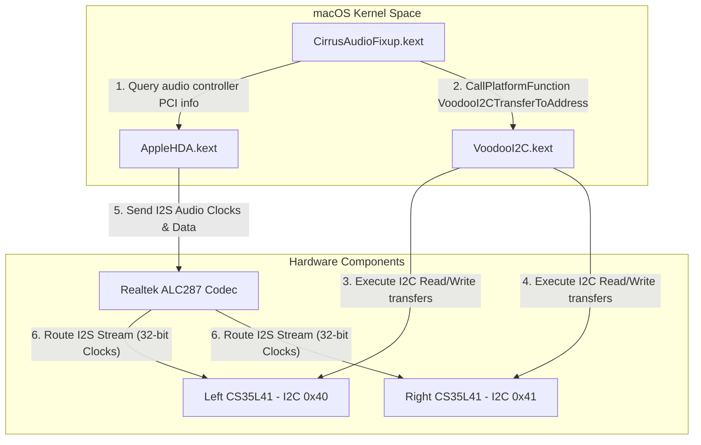

# CirrusAudioFixup

An experimental, open-source macOS kernel extension (kext) designed to initialize, configure, and reverse-engineer the **Cirrus Logic CS35L41** smart speaker amplifiers on Hackintosh systems. This project specifically targets the **Lenovo Legion 7 16ACHg6** (AMD platform) equipped with a **Realtek ALC287** audio codec.

> [!IMPORTANT]
> **Project Status: Experimental / Audio Output is NOT Working**
> 
> This is a personal hobby and research project. The developer does **not** have professional experience in macOS kernel development or IOKit driver writing. This driver has been built entirely through trial-and-error by adapting Linux kernel source code (`cs35l41-hda` and `cs_dsp`) to macOS IOKit.
> 
> **At present, this kext DOES NOT play audible sound.** While it successfully communicates with the hardware and initializes the amplifiers, the system remains muted due to DSP firmware locking and clock-sync issues with AppleHDA. I don't know what is wrong but i can't fix it. I have tried everything i can but no luck. Any help is appreciated.

---

## Architecture Overview

The driver acts as a middleman between the macOS kernel services, the user-space configurations, and the physical amplifiers. The overall communications flow is shown below:



Since the macOS kernel does not allow two drivers to own the same I2C controller simultaneously, `CirrusAudioFixup` does not talk directly to the AMD I2C hardware. Instead, it locates the active `VoodooI2C` instance and requests read/write operations through the custom platform function `VoodooI2CTransferToAddress`.

---

## Detailed Code Flow & Methods Reference

Below is a detailed guide of the functions, structures, and algorithms implemented in [CirrusAudioFixup.cpp](file:///Users/hoaug/Documents/CirrusAudioFixup/CirrusAudioFixup/CirrusAudioFixup.cpp) to help other developers join, debug, and expand this project.

### 1. Entry point and AMD GPIO 6 Reset Toggle
- **`start(IOService *provider)`**
  This is the driver's entry point called by IOKit when matching hardware. It does the following:
  1. Searches the IORegistry for the `AMDI0030` service (the AMD GPIO controller).
  2. Map-allocates the MMIO memory address.
  3. Locates **GPIO Pin 6** (which physically controls the hardware reset line of the speaker amplifiers on this laptop).
  4. Triggers a hardware reset toggle sequence: pulls Pin 6 low, sleeps for 5ms, and pulls Pin 6 high.
  5. Schedules the main diagnostic loop: `probeAmp` is called for both the Left (`0x40`) and Right (`0x41`) amplifiers.

### 2. Main Workflow Orchestrator
- **`probeAmp(CS35L41Amp &amp)`**
  This is the state machine orchestrating the bootstrap phase of each individual amplifier. It runs through the following sequence:
  1. Checks if the kext is booted in `cirrus_readonly` mode (if yes, it stops here to prevent writes).
  2. Runs `initCodec` to verify basic chip IDs and hardware revisions.
  3. Applies the revision-specific hardware errata patches (`initializeHardwareErrata`).
  4. Unpacks the factory calibration data from OTP memory (`unpackOTP`).
  5. Configures the phase-locked loops (`applyPLL`).
  6. Configures the digital serial audio interface (`applyASP`).
  7. Configures the amplifier GPIO lines (`applyGPIO`).
  8. Attempts to load firmware and start the DSP subsystem (`discoverFirmware`, `bringupDSP`, `uploadFirmware`, `initializeFirmware`).
  9. If the DSP fails (e.g. because firmware is rejected or in ROM mode), it rolls back and starts the non-DSP fallback sequence (`powerUpAmplifier`) to route audio directly from the ASP serial input to the DAC.

### 3. Low-Level Helper Methods
- **`readRegister(CS35L41Amp &amp, UInt32 reg, UInt32 *val)`** / **`writeRegister(CS35L41Amp &amp, UInt32 reg, UInt32 val)`**
  Formats register addresses and data payloads into big-endian byte arrays and packages them as standard I2C transactions to be executed via `VoodooI2CTransferToAddress`.
- **`updateRegisterBits(CS35L41Amp &amp, UInt32 reg, UInt32 mask, UInt32 val)`**
  A utility performing read-modify-write operations to selectively edit bits inside a register without altering surrounding flags.
- **`bulkRead(CS35L41Amp &amp, UInt32 reg, UInt8 *data, UInt16 len)`** / **`bulkWrite(...)`**
  Used to read/write large sequential memory segments (such as OTP blocks or DSP SRAM regions) in a single fast bus session.

### 4. OTP Memory Unpacking Mathematics
- **`unpackOTP(CS35L41Amp &amp)`**
  Every amplifier has specific resistance, current, and temperature coefficients programmed at the factory into a 320-byte OTP (One-Time Programmable) memory block. 
  The kext reads these 80 big-endian words, translates them to host endianness, and unpacks variables using bit shifting and masking (`GENMASK`). 
  
  For example, the chip's internal calibration for speaker resistance (`R_EXT`) is extracted using:
  ```cpp
  uint32_t r_ext = (otp_mem[word_index] >> bit_shift) & 0x3F;
  ```
  These values are then written back to target calibration control registers (`CS35L41_AMP_GAIN_CTRL`, thermal models, etc.) to ensure the amplifier operates safely and doesn't burn out the speakers.

### 5. Errata Application & Test Keys
- **`unlockTestKey(CS35L41Amp &amp)`** / **`lockTestKey(CS35L41Amp &amp)`**
  The CS35L41 protects sensitive tuning registers using hardware locks. To unlock them, the driver writes the keys `0x00000055` and `0x000000AA` sequentially to `CS35L41_TEST_KEY_CTL (0x00000040)`. To lock, it writes `0x000000CC` and `0x00000033`.
- **`initializeHardwareErrata(CS35L41Amp &amp)`**
  While the test keys are unlocked, the driver writes B2 revision patches (e.g. configuring memory read thresholds and disabling the default DSP core enable bit `HALO_CORE_EN` to prepare for clean memory loads).

### 6. Clock Ratio Constraints & PLL Locking
- **`applyASP(CS35L41Amp &amp)`**
  Configures the Audio Serial Port (ASP). Under macOS, AppleHDA configures the Realtek ALC287 codec to output I2S audio frames with **32-bit slot widths** at **48kHz**.
  If the CS35L41 serial port is configured to 24-bit slot width, the clocks drift, the internal phase-locked loop (PLL) loses synchronization, and the DAC stays dead.
  To ensure lock, the kext forces:
  - `CS35L41_SP_FORMAT (0x00004808)` = `0x20200200` (32-bit Tx/Rx slots, I2S mode)
  - `CS35L41_SP_RATE_CTRL (0x00004804)` = `0x00000021` (48kHz sample rate)
- **`applyPLL(CS35L41Amp &amp)`**
  Initializes the PLL block and verifies lock status. The driver polls register `0x00010018` to check if `INT3_PLL_LOCK (0x00000002)` is set. If this bit stays low, audio paths are disabled.

### 7. DSP Firmware Upload & ROM Mode Limitations
- **`uploadFirmware(CS35L41Amp &amp)`**
  Reads the system subsystem ID (SSID) from the host audio controller. It parses the matching firmware blocks (`.wmfw` file structure) and coefficient tables (`.bin` files) from [FirmwareDatabase.hpp](file:///Users/hoaug/Documents/CirrusAudioFixup/CirrusAudioFixup/Codecs/CS35L41/FirmwareDatabase.hpp).
  It issues bulk writes to write these instructions to PM (Program Memory), XM (X-parameter Memory), and YM (Y-parameter Memory) SRAM regions on the DSP core.
- **`parseDSPAlgorithms(CS35L41Amp &amp)`**
  Dumps the first 16KB of XM memory (`0x02800000` to `0x02804000`) and parses algorithm header blocks to build telemetry statistics.
- **The Mailbox Failures**:
  Currently, we are using mock firmware headers and coefficient tables because the exact tuning configurations for this laptop's acoustics are missing. Without a valid binary match, the DSP is restricted to ROM mode. 
  In ROM mode, sending mailbox commands (like `SPK_OUT_ENABLE (7)` to resume the DSP and enable speaker output) results in command rejections and driver timeouts.

### 8. Fallback Direct DAC Routing (Bypassing DSP)
- **`powerUpAmplifier(CS35L41Amp &amp)`**
  Since the DSP rejects mailbox commands without firmware, this method executes the Linux fallback routine to bypass the DSP entirely, routing the raw I2S stream directly to the speaker DAC:
  1. Map `CS35L41_DAC_PCM1_SRC` to `0x08` (Left) and `0x09` (Right) to feed the DAC directly from the serial input.
  2. Unlock test key registers.
  3. Write safe-to-active transition values: write `0x0F` and `0x79` to `0x0000742C`, and `0x00585941` to `0x00007438`.
  4. Enable the global power bit: write `1` to `CS35L41_PWR_CTRL1 (0x00002014)`.
  5. Poll `CS35L41_IRQ1_STATUS1 (0x00010010)` until `PUP_DONE` (`0x01000000`) is flagged (verifying the analog block is powered).
  6. Enable speakers paths: write `0xF9` to `0x0000742C`, and `0x00580941` to `0x00007438`.
  7. Lock test key registers.
  8. Enable the output stages and monitors by writing `0x00003001` to `CS35L41_PWR_CTRL2 (0x00002018)`.
  9. Unmute the digital volume `CS35L41_AMP_DIG_VOL_CTRL (0x00002090)` to `0x00008000` (0dB).

---

## Known Roadblocks & Challenges

If you want to contribute and continue this project, these are the primary roadblocks preventing sound playback:

### 1. The EAPD Codec Power Down Problem
The physical reset/shutdown lines of the CS35L41 amplifiers are tied to the EAPD (External Amplifier Power Down) pins of the ALC287 codec. 
Even when the kext completes the sequence and writes `GLOBAL_EN=1`, macOS AppleHDA aggressively pulls the EAPDs low on codec nodes `0x14`, `0x1b`, and `0x21` when no audio is playing. This cuts power to the amplifiers. We tried forcing EAPD pins high manually via HDA verbs, but the system remained silent.

### 2. AppleALC Layout and Clock Routing
The clock ratio between macOS AppleHDA and the CS35L41 must match perfectly. If the ALC287 codec routing is modified or set to 24-bit slots, the PLL immediately loses lock, producing no audio. Finding a way to cleanly sync AppleALC layouts with the CS35L41 I2S clocks remains unresolved.

---

## Requirements

> [!WARNING]
> This kext requires a custom build of VoodooI2C containing the platform function patch. You **must** download, compile, and use the VoodooI2C repository from:
> [hoaug-tran/VoodooI2C](https://github.com/hoaug-tran/VoodooI2C)
>
> Using standard release versions of VoodooI2C will prevent the kext from establishing I2C communications with the amplifiers.

---

## Configuration Boot Arguments

List of NVRAM parameters to customize driver behavior:

| Parameter | Value | Description |
| :--- | :--- | :--- |
| `cirrus_probe` | `1` | Enables verbose register access logging. |
| `cirrus_readonly` | `1` | Activates read-only monitoring (safe mode). |
| `cirrus_phase` | `<phase>` | Restricts driver start to debugging phases (`4A1`, `4B`, `5B`, `5C`). |
| `cirrus_dump_compact`| `1` | Formats register dumps cleanly to save NVRAM block size. |

---

## How to Build

1. Clone this repository locally.
2. Build with xcodebuild:
   ```bash
   xcodebuild -scheme CirrusAudioFixup -configuration Debug build
   ```
3. Copy `build/Debug/CirrusAudioFixup.kext` into your EFI kext directory.
4. Ensure `VoodooI2C.kext` (with platform patch) is loaded **before** `CirrusAudioFixup.kext`.
