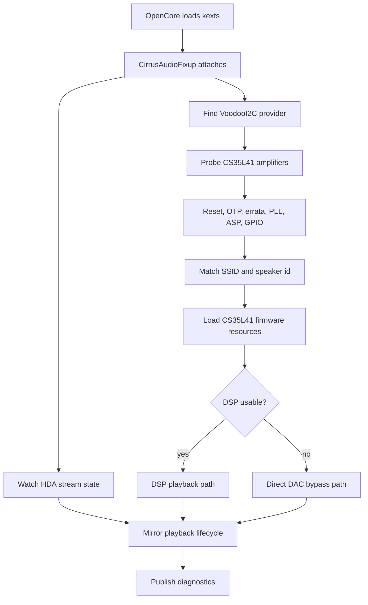

# CirrusAudioFixup


CirrusAudioFixup is a macOS kernel extension for laptops with smart speaker amplifiers on the HDA audio path.

The current target is a dual CS35L41 amplifier design. The kext can attach, find the amps, talk over VoodooI2C, run the CS35L41 bring-up flow, parse and upload firmware, watch HDA playback state, and publish useful diagnostics.

Audible speaker output is still not confirmed.

> [!CAUTION]
> This is not a finished audio fix. It touches kernel code, I2C transfers, amplifier power, DSP firmware, and speaker protection paths. Use it only if you can recover from a bad boot.

> [!IMPORTANT]
> Do not pay for this kext. If you paid for it, you were scammed.

## Project state

| Area | Current state |
| --- | --- |
| IOKit attach | Works on the current old-match profile |
| VoodooI2C transfer path | Works with custom `VoodooI2CTransferToAddress` |
| CS35L41 register access | Works |
| Reset, OTP, errata, PLL, ASP, GPIO | Implemented |
| HDA stream watcher | Implemented |
| Firmware parser and upload planner | Implemented |
| Embedded CS35L41 firmware profile | Present for `17AA:3847`, speaker id `1` |
| Bypass playback path | Implemented |
| DSP playback path | Still under investigation |
| Audible internal speakers | Not confirmed |
| Generic laptop support | Not automatic |

> [!WARNING]
> Passing the current checks means the driver flow is sane. It does not prove your speakers will make sound.

## What this project is

This project is a driver research repo for smart amplifier bring-up on Hackintosh systems.

It aims to make the flow visible and testable:

- IOKit attach and provider discovery.
- VoodooI2C register transport.
- CS35L41 silicon bring-up.
- HDA playback state tracking.
- Firmware and tuning resource matching.
- DSP or bypass playback decisions.
- Failure reports through IORegistry and kernel logs.

It is not a universal patch for every HDA codec, every amplifier, or every laptop.

## Current hardware profile

| Item | Value |
| --- | --- |
| Amplifier | CS35L41 |
| Layout | Dual I2C amplifiers |
| Current attach match | `CLSA0100` through `VoodooI2CDeviceNub` |
| Embedded firmware profile | `17AA:3847`, speaker id `1` |
| Known SSID quirk | `17AA:382B` to `17AA:3847` |
| HDA route used during testing | converter NID `0x03` to speaker pin NID `0x17` |
| AppleALC layout used during testing | layout-id `16` |

> [!NOTE]
> Other laptops need real data: IORegistry, HDA codec dump, AppleALC route, amplifier IDs, I2C addresses, and matching firmware or tuning resources.

## What works now

Current code can:

- Attach without changing the old boot-safe match behavior.
- Find the VoodooI2C provider.
- Read and write CS35L41 registers.
- Verify device id and revision id.
- Apply reset, OTP, errata, PLL, ASP, GPIO, and power flow.
- Parse WMFW firmware and WMDR coefficient files.
- Upload embedded CS35L41 firmware and tuning data.
- Use a direct DAC bypass path when DSP mode is not usable.
- Watch HDA playback and mirror open, prepare, cleanup, and close style events.
- Export detailed diagnostics for failed stages.
- Run host-side regression tests on Windows or macOS with Python and a compiler.

Current limits:

- Audible macOS speaker output is not confirmed.
- Other HDA codecs are not proven.
- Other Intel or AMD platforms are not proven.
- Other amplifier families are not implemented.
- Firmware matching is limited to real embedded resources.

## Required kexts

You need custom kexts for the current flow.

| Kext | Why it matters |
| --- | --- |
| `AppleALC.kext` custom layout | Owns the HDA route and must create the correct speaker stream |
| `VoodooI2C.kext` custom build | Must expose `VoodooI2CTransferToAddress` |
| `Lilu.kext` | Required by AppleALC |
| `VirtualSMC.kext` or equivalent | Normal base Hackintosh stack |

> [!WARNING]
> A normal VoodooI2C release will not work unless it has the platform transfer function used by this kext.

## First boot checklist

Before first boot:

1. Keep a working EFI backup.
2. Keep a boot entry without CirrusAudioFixup.
3. Know how to remove a bad kext from recovery or another OS.
4. Use the custom VoodooI2C build.
5. Use the matching custom AppleALC layout.
6. Do not use random firmware or tuning files.
7. Do not force an SSID unless you know the matching tuning is correct.

Recommended first boot arguments:

```text
-cirrusdbg -cirrusnodsp
```

After clean identity, reset, and I2C logs, test without `-cirrusnodsp`.

## Boot arguments

| Argument | Use |
| --- | --- |
| `-cirrusoff` | Disable this kext without removing it |
| `-cirrusdbg` | Enable detailed diagnostics |
| `-cirrusprobe` | Log register access; very noisy |
| `-cirrusdiag` | Run expensive CRC and register scans |
| `-cirrusnodsp` | Skip DSP load and use bypass path |
| `-cirrusro` | Read-only monitoring mode |
| `-cirruscompact` | Reduce log size |
| `-cirrusphase=<phase>` | Stop bring-up at a debug phase |
| `-cirrusssid=<hex>` | Override firmware SSID for controlled tests |
| `-cirrusspkid=<n>` | Override speaker id for controlled tests |

## How it works


```mermaid
flowchart TD
    Boot[OpenCore loads kexts] --> Attach[CirrusAudioFixup attaches]
    Attach --> Provider[Find VoodooI2C provider]
    Provider --> Probe[Probe CS35L41 amplifiers]
    Probe --> Bringup[Reset, OTP, errata, PLL, ASP, GPIO]
    Bringup --> Match[Match SSID and speaker id]
    Match --> Firmware[Load CS35L41 firmware resources]
    Firmware --> Mode{DSP usable?}
    Mode -->|yes| DSP[DSP playback path]
    Mode -->|no| Bypass[Direct DAC bypass path]
    Attach --> HDA[Watch HDA stream state]
    HDA --> Power[Mirror playback lifecycle]
    DSP --> Power
    Bypass --> Power
    Power --> Diag[Publish diagnostics]
```

Main stages:

1. Attach to the current VoodooI2C device nub match.
2. Apply a platform reset quirk if one matches.
3. Probe left and right amplifier addresses.
4. Validate device id and revision id.
5. Apply OTP, errata, PLL, ASP, GPIO, and power setup.
6. Read subsystem id and speaker id.
7. Select a matching firmware entry.
8. Upload firmware or use bypass mode.
9. Watch HDA playback state.
10. Move amps between safe idle and playback states.
11. Record the first failure and latest failure.

## Repository map

| Path | Purpose |
| --- | --- |
| `CirrusAudioFixup/` | Kext source and `Info.plist` |
| `CirrusAudioFixup/Devices/CS35L41/` | CS35L41 hardware code |
| `CirrusAudioFixup/Devices/CS35L41/Resources/Firmware.hpp` | CS35L41 embedded firmware table |
| `CirrusAudioFixup/Firmware/WMFW/` | WMFW and coefficient parsing and upload planning |
| `CirrusAudioFixup/Platform/HDA/` | HDA controller and stream watcher |
| `CirrusAudioFixup/Transport/` | VoodooI2C transport wrapper |
| `Tests/` | Host-side regression checks |
| `Tools/import_firmware.py` | Firmware validation and import helper |
| `.github/` | CI, labels, issue templates, and PR template |

## Firmware resources

`Firmware.hpp` is local to `Devices/CS35L41/Resources/`.

It is not a global firmware database. It should contain only CS35L41 resources. A future amplifier family should get its own device directory and its own `Resources/Firmware.hpp`.

> [!IMPORTANT]
> Do not add placeholder firmware entries. Do not map a new laptop to an old tuning profile unless the hardware and acoustics are known to match.

Validate files only:

```bash
python Tools/import_firmware.py --codec cs35l41 --ssid 17AA3847 --wmfw path/to/file.wmfw --bin-l path/to/left.bin --bin-r path/to/right.bin --validate-only
```

Import a real profile:

```bash
python Tools/import_firmware.py --codec cs35l41 --ssid 17AA3847 --wmfw path/to/file.wmfw --bin-l path/to/left.bin --bin-r path/to/right.bin
```

## Build

Release build:

```bash
xcodebuild -project CirrusAudioFixup.xcodeproj -target CirrusAudioFixup -configuration Release -sdk macosx CODE_SIGNING_REQUIRED=NO CODE_SIGN_IDENTITY="" CODE_SIGNING_ALLOWED=NO build
```

GitHub Actions also runs the release build on macOS.

## Test

Run all host checks before a pull request:

```bash
python Tests/reproduce_host.py
python Tests/check_registers.py
python Tests/check_transport.py
python Tests/check_diagnostics.py
python Tests/check_hda.py
python Tests/check_calibration.py
python Tests/check_bringup.py
python Tests/check_runtime.py
```

> [!TIP]
> Test logs include many `ERROR` lines by design. Fault-injection tests must hit error paths. Trust the exit code and `PASS` lines.

## Install for testing

1. Build the kext.
2. Copy `CirrusAudioFixup.kext` to your EFI kext folder.
3. Load order should be `Lilu`, `VirtualSMC`, `AppleALC`, custom `VoodooI2C`, then `CirrusAudioFixup`.
4. Start with `-cirrusdbg -cirrusnodsp`.
5. Save boot logs and IORegistry output.
6. Remove `-cirrusnodsp` only after the basic path is clean.

Check these before testing sound:

- Custom VoodooI2C loads before CirrusAudioFixup.
- AppleALC layout matches the HDA route.
- `layout-id` and `alcid` do not conflict.
- IORegistry has clean `Cirrus_Driver_Verdict` and stage data.

## Logs for reports

Collect both outputs after a failed boot:

```bash
log show --last boot --style syslog --predicate 'eventMessage CONTAINS "CirrusAudioFixup"'
ioreg -lw0 | grep -E 'Cirrus_(Driver|Diag|Trace|Playback|HDA|DSP|PCI|SSID)'
```

Useful IORegistry keys:

| Key | Meaning |
| --- | --- |
| `Cirrus_Driver_Verdict` | `READY_DSP`, `READY_BYPASS`, or `FAILED_INIT` |
| `Cirrus_Diag_Stage_left/right` | Stage running when the latest event happened |
| `Cirrus_Diag_LastGood_left/right` | Last completed stage |
| `Cirrus_Diag_FirstFailure_left/right` | First root failure |
| `Cirrus_Diag_LatestFailure_left/right` | Latest failure |
| `Cirrus_Trace_First_left/right` | First failure transfer trace |
| `Cirrus_Trace_Latest_left/right` | Latest failure transfer trace |
| `Cirrus_Playback_Verdict_left/right` | Playback path verdict |
| `Cirrus_HDA_*` | HDA controller and stream state |
| `Cirrus_SSID_*` | Firmware profile identity |

## Troubleshooting map

| Failure area | Likely boundary |
| --- | --- |
| `PROVIDER_MISSING`, `I2C_TRANSFER` | VoodooI2C provider or transfer function |
| `DEVICE_ID`, reset write failures | I2C address, power rail, reset GPIO, ACPI path |
| `OTP_TIMEOUT`, `OTP_UNPACK` | OTP boot or calibration parsing |
| `ERRATA` | CS35L41 revision handling |
| `FIRMWARE_*`, `COEFFICIENT_*` | WMFW or BIN mismatch |
| `DSP_BOOT`, `DSP_MAILBOX` | DSP image load or firmware runtime |
| `HDA_CONTROLLER`, `HDA_STREAM_FORMAT` | AppleHDA, AppleALC layout, or playback format |
| `PLL_UNLOCKED` | HDA clocks not reaching the amplifier |
| `ACTIVE_DIGITAL_PATH_VERIFIED` with silence | I2S content, boost, analog path, or speaker path still wrong |

## Contributing

Read [CONTRIBUTING.md](CONTRIBUTING.md) before opening a pull request.

Good pull requests are small, tested, and easy to review.
Before opening a PR:

- Keep `Info.plist` attach behavior boot-safe.
- Do not add broad hardware matches without IORegistry proof.
- Do not add fake firmware or tuning data.
- Keep new support scoped by amplifier family.
- Run the full host test set.
- Explain the hardware used for testing.
- Include boot, attach, I2C, HDA, and playback logs.

For new hardware support, include:

- Laptop model.
- CPU platform.
- HDA codec id and subsystem id.
- ACPI device name under VoodooI2C.
- I2C addresses.
- Amplifier id and revision id.
- AppleALC layout.
- Linux codec dump if available.
- Firmware and tuning source if adding resources.

## Labels

Suggested GitHub labels live in `.github/labels.yml`.

Core labels:

- `type: bug`
- `type: hardware-support`
- `type: firmware`
- `type: docs`
- `type: tests`
- `area: iokit`
- `area: voodooi2c`
- `area: hda`
- `area: cs35l41`
- `risk: boot`
- `risk: speaker-safety`
- `status: needs-logs`
- `status: blocked`
- `good first issue`

## License

This project uses `GPL-2.0-only`.

MIT would be easier, but GPL-2.0-only is the safer choice here because the driver behavior is based on Linux kernel CS35L41, HDA component, and DSP driver work. Linux kernel code is GPL-2.0-only.

Copyright for original project code belongs to Tran Kinh Hoang (hoaug-tran), unless a file says otherwise.

Keep attribution when porting ideas, register flows, or behavior from Linux drivers such as `cs35l41-hda` and `cs_dsp`.

