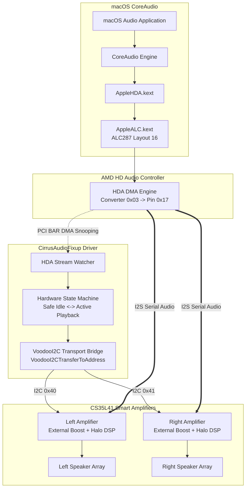

# CirrusAudioFixup

<div align="center">


**macOS kernel extension for Cirrus Logic CS35L41 smart amplifiers over I2C.**

[Overview](#overview) • [How It Works](#how-it-works) • [Linux Driver Lineage](#linux-driver-lineage) • [Installation](#installation) • [Boot Arguments](#boot-arguments) • [Telemetry](#telemetry--diagnostics) • [Troubleshooting](#troubleshooting)

</div>

---

> [!CAUTION]
> This driver directly manages amplifier power stages, external boost converters, and DSP acoustic protection. Use only with validated configurations. Never force mismatched firmware profiles or custom voltages.

> [!IMPORTANT]
> This project is 100% free and open-source under GPL-2.0. If someone sold this to you, you were scammed.

---

## Overview

Modern laptops route speaker audio through digital smart amplifiers (like the **Cirrus Logic CS35L41**) connected via I2C instead of standard analog codec pins. AppleALC handles the primary Realtek codec for headphones, but internal laptop speakers remain silent because the amplifiers require dedicated I2C power-up, silicon errata patches, boost converter sequencing, and DSP calibration.

**CirrusAudioFixup** bridges this gap:

- Controls dual CS35L41 smart amplifiers over I2C via VoodooI2C.
- Snoops HDA DMA stream state on the AMD HD Audio controller to dynamically power up amplifiers when sound starts playing.
- Applies silicon errata, unpacks OTP calibration, and loads acoustic protection firmware from `linux-firmware`.
- Soft-mutes and powers down the amplifiers to safe low-power idle when audio stops, eliminating clicks and pops.

> [!TIP]
> **Verified Reference Platform & Complete Working EFI:**  
> Verified on the [Lenovo Legion 7 16ACHg6 2021](https://github.com/hoaug-tran/Lenovo-Legion-7-16ACHG6-Hackintosh) (`17AA:3847` / `17AA:382B`) with Realtek ALC287 (`alcid=16`), Dual CS35L41 (`0x40`, `0x41`), and External Boost. A ready-to-use OpenCore EFI is available in the linked repository.

---

## How It Works


```mermaid
flowchart TD
    subgraph macOS CoreAudio
        App[macOS Audio Application] --> CoreAudio[CoreAudio Engine]
        CoreAudio --> AppleHDA[AppleHDA.kext]
        AppleHDA --> AppleALC[AppleALC.kext\nALC287 Layout 16]
    end

    subgraph AMD HD Audio Controller
        AppleALC --> HDAStream[HDA DMA Engine\nConverter 0x03 -> Pin 0x17]
    end

    subgraph CirrusAudioFixup Driver
        HDAStream -.->|PCI BAR DMA Snooping| Watcher[HDA Stream Watcher]
        Watcher --> FSM[Hardware State Machine\nSafe Idle <-> Active Playback]
        FSM --> Transport[VoodooI2C Transport Bridge\nVoodooI2CTransferToAddress]
    end

    subgraph CS35L41 Smart Amplifiers
        Transport -->|I2C 0x40| AmpL[Left Amplifier\nExternal Boost + Halo DSP]
        Transport -->|I2C 0x41| AmpR[Right Amplifier\nExternal Boost + Halo DSP]
        HDAStream ==>|I2S Serial Audio| AmpL
        HDAStream ==>|I2S Serial Audio| AmpR
        AmpL --> SpkL[Left Speaker Array]
        AmpR --> SpkR[Right Speaker Array]
    end
```

### 3-Stage Lifecycle

1. **Silicon Bring-up (Boot)**:
   Probes I2C targets (`0x40`, `0x41`), validates Device ID (`0x35A40`), unpacks OTP calibration words, and applies silicon revision B2 errata patches.
2. **DSP Firmware Staging**:
   Matches subsystem ID (`17AA:3847`), uploads WMFW code and per-channel coefficient binaries to the Halo DSP core, and verifies DSP heartbeat.
3. **Dynamic Playback Synchronization**:
    - **Stream Start**: Unlocks test keys, engages external boost converter (`0x742C`/`0x7438`), waits for `PUP_DONE`, enables DSP speaker output (`kCmdMailboxSpeakerOutputEnable`), and ramps up volume smoothly.
    - **Stream Stop**: Sends soft-mute mailbox command (`kCmdMailboxSpeakerOutputDisable`), pauses DSP, powers down analog stage (`PDN_DONE`), and returns to safe idle.

---

## Linux Driver Lineage

CirrusAudioFixup is engineered from the official Linux kernel ALSA/ASoC subsystem. Register addresses, bitmasks, timing constraints, and power sequences match the following drivers bit-for-bit:

| Linux Kernel Driver File                              | Subsystem            | Purpose & Parity in CirrusAudioFixup                                                                                                                         |
| :---------------------------------------------------- | :------------------- | :----------------------------------------------------------------------------------------------------------------------------------------------------------- |
| `sound/hda/codecs/side-codecs/cs35l41_hda.c`          | ALSA HDA Side-Codec  | Power state transitions (`safe_to_active` / `active_to_safe`), mailbox commands (`PAUSE`, `RESUME`, `OUT_ENABLE`, `OUT_DISABLE`), and volume unmute ramping. |
| `sound/hda/codecs/side-codecs/cs35l41_hda_property.c` | ACPI Property Parser | Lenovo Legion quirks: `CS35L41_EXT_BOOST` power rail sequencing, I2C addresses `0x40` & `0x41`, speaker ID indexing (`spkid=1`).                             |
| `sound/soc/codecs/cs35l41-lib.c`                      | Silicon Core Library | Hardware reset timing, OTP memory unpacking (`unpackOTP`), silicon revision B2 errata (`kCs35l41RevB2ErrataPatch`), PLL locking, and ASP format.             |
| `include/sound/cs35l41.h`                             | Kernel Definitions   | Full register map (`0x00000000`–`0x02BC3140`), IRQ masks, power status bits, and protection fault masks (`0x800281C0`).                                      |
| `sound/pci/hda/patch_realtek.c` & `alc269.c`          | Realtek Codec Fixups | ALC287 initialization verbs, `ALC287_FIXUP_LEGION_16ACHG6` quirk, and clock synchronization between Realtek codec and CS35L41 amps.                          |
| `drivers/firmware/cirrus/wmfw.h` & `wm_adsp.c`        | Halo DSP Subsystem   | WMFW header decoding, chunk parsing (text, data, info), coefficient packing, and DSP memory distribution.                                                    |

> [!NOTE]
> **Firmware Provenance:** Embedded firmware in `Devices/CS35L41/Resources/Firmware.hpp` originates from upstream [linux-firmware](https://git.kernel.org/pub/scm/linux/kernel/git/firmware/linux-firmware.git):
>
> - `cirrus/cs35l41-dsp1-spk-prot-17aa3847.wmfw` (Cirrus Halo CSPL release `v6.39.0 / halo_cspl_RAM_revB2_29.41.0.wmfw`)
> - `cirrus/cs35l41-dsp1-spk-prot-17aa3847-spkid1-l0.bin` (Left speaker calibration)
> - `cirrus/cs35l41-dsp1-spk-prot-17aa3847-spkid1-r0.bin` (Right speaker calibration)
>
> Laptops with SSID `17AA:382B` (Legion 5 Pro) share an identical acoustic setup and are automatically mapped to `17AA:3847`.

---

## Installation

### 1. Requirements

- `Lilu.kext` (v1.6.8 or newer)
- `AppleALC.kext` (configured with `layout-id: 16`)
- `VirtualSMC.kext`
- **Custom `VoodooI2C.kext`**: Must expose `VoodooI2CTransferToAddress`. Download from [hoaug-tran/VoodooI2C](https://github.com/hoaug-tran/VoodooI2C/actions).
- `CirrusAudioFixup.kext`

> [!WARNING]
> Stock upstream VoodooI2C does not expose arbitrary 32-bit register transfers to unattached I2C target addresses. You **must** use the custom fork from [hoaug-tran/VoodooI2C](https://github.com/hoaug-tran/VoodooI2C).

### 2. OpenCore Kext Load Order

In `config.plist` under `Kernel -> Add`, configure the load order as follows:

```text
1. Lilu.kext
2. VirtualSMC.kext
3. AppleALC.kext
4. VoodooI2C.kext (custom fork)
5. CirrusAudioFixup.kext
```

### 3. Recommended Boot Arguments

For your initial boot, add to `NVRAM -> Add -> 7C436110-... -> boot-args`:

```text
alcid=16 -cirrusdbg -cirrusnodsp
```

> [!TIP]
> `-cirrusnodsp` boots the amplifiers in direct DAC bypass mode. Once speaker output is confirmed in bypass mode, remove `-cirrusnodsp` to activate the Halo DSP protection engine and acoustic equalization.

---

## Boot Arguments

| Argument            | Category    | Description                                                                   |
| :------------------ | :---------- | :---------------------------------------------------------------------------- |
| _(None)_            | **Default** | Normal operation with full DSP firmware loading and dynamic power management. |
| `-cirrusoff`        | Recovery    | Completely disables CirrusAudioFixup without removing the kext file.          |
| `-cirrusdbg`        | Diagnostics | Enables verbose log messages in the macOS system log.                         |
| `-cirrusnodsp`      | Mode        | Bypasses DSP firmware upload; runs amplifiers in direct DAC bypass mode.      |
| `-cirrusprobe`      | Debug       | Logs low-level I2C register transactions (very verbose).                      |
| `-cirrusro`         | Safety      | Read-only mode; monitors audio streams without writing to I2C registers.      |
| `-cirrusdiag`       | Diagnostics | Runs periodic CRC register validation checks across active playback.          |
| `-cirruscompact`    | Logging     | Limits log line length for smaller kernel buffer footprints.                  |
| `-cirrusssid=<hex>` | Testing     | Overrides detected ACPI Subsystem ID (e.g. `-cirrusssid=0x17AA3847`).         |
| `-cirrusspkid=<n>`  | Testing     | Overrides hardware speaker ID index (default: `1`).                           |

---

## Telemetry & Diagnostics

Verify amplifier health in Terminal without restarting:

```bash
ioreg -lw0 -p IODeviceTree -n CLSA0100 | grep -E 'Cirrus_(Driver|Diag|Playback|HDA|DSP|SSID)'
```

| IORegistry Property              | Expected Value                                        | Meaning                                                              |
| :------------------------------- | :---------------------------------------------------- | :------------------------------------------------------------------- |
| `Cirrus_Driver_Verdict`          | `READY_DSP`                                           | All amplifiers probed, errata applied, and DSP firmware running.     |
| `Cirrus_Playback_Verdict_host`   | `SAFE_IDLE_VERIFIED` / `ACTIVE_DIGITAL_PATH_VERIFIED` | Dynamic HDA state machine cleanly tracks audio stream lifecycle.     |
| `Cirrus_Diag_FirstFailure_left`  | `NONE`                                                | No errors on left amplifier.                                         |
| `Cirrus_Diag_FirstFailure_right` | `NONE`                                                | No errors on right amplifier.                                        |
| `Cirrus_HDA_StreamActive`        | `Yes` / `No`                                          | Indicates whether macOS is actively streaming audio to the speakers. |

To inspect kernel logs in real time:

```bash
log show --last boot --style syslog --predicate 'eventMessage CONTAINS "CirrusAudioFixup"'
```

---

## Troubleshooting

> [!NOTE]
> **No sound from internal speakers:**
>
> 1. Verify `VoodooI2C.kext` is the custom fork and loads **before** `CirrusAudioFixup.kext`.
> 2. Ensure `alcid=16` is set in boot-args and the macOS output device is set to "Internal Speakers".
> 3. Run the `ioreg` command above. If `Cirrus_Driver_Verdict` reports `FAILED_INIT`, check `Cirrus_Diag_FirstFailure` to identify the failing stage.

> [!TIP]
> **Audio clicks or pops when pausing:**
> CirrusAudioFixup automatically issues mailbox soft-mute commands (`0x08`) before pausing the DSP. If you experience pops, ensure you are running without `-cirrusnodsp` so the DSP soft-mute curve is active.

---

## Building & Automated Testing

### Build with Xcode (macOS)

```bash
xcodebuild -project CirrusAudioFixup.xcodeproj \
           -target CirrusAudioFixup \
           -configuration Release \
           -sdk macosx \
           CODE_SIGNING_REQUIRED=NO \
           CODE_SIGN_IDENTITY="" \
           CODE_SIGNING_ALLOWED=NO build
```

### Run Host Test Suite (macOS / Linux / Windows)

The test suite validates register logic, OTP unpacking, errata patching, and HDA state tracking using mocked hardware:

```bash
python Tests/reproduce_host.py
python Tests/check_registers.py
python Tests/check_transport.py
python Tests/check_diagnostics.py
python Tests/check_hda.py
python Tests/check_calibration.py
python Tests/check_bringup.py
python Tests/check_runtime.py
```

---

## Contributing

Contributions improving amplifier compatibility or adding verified hardware profiles are welcome. Please review [CONTRIBUTING.md](CONTRIBUTING.md) before submitting a pull request.

- **PR Requirements**: New laptop models require an ACPI table dump (`DSDT`/`SSDT`), Linux ALSA codec dump, and verified `linux-firmware` binaries.
- **Verification**: All Python tests in `Tests/` and the Xcode build must pass with zero regressions.

---

## License & Credits

- **License**: Non-Commercial Software Distribution License ([LICENSE](LICENSE)) — Free for personal use, modification, and service integration; strictly no selling or monetization of the Software itself.
- **Author**: Tran Kinh Hoang ([@hoaug-tran](https://github.com/hoaug-tran))
- **Special Thanks**:
    - The [Acidanthera](https://github.com/acidanthera) team for Lilu and AppleALC.
    - The [VoodooI2C](https://github.com/VoodooI2C/VoodooI2C) team for the I2C transport framework.
    - Cirrus Logic and the Linux ALSA/ASoC kernel maintainers for open-source driver specifications.
