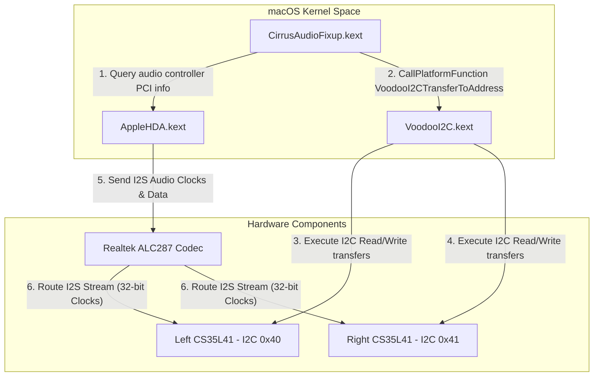

# CirrusAudioFixup

An experimental, open-source macOS kernel extension (kext) designed to initialize, configure, and reverse-engineer the **Cirrus Logic CS35L41** smart speaker amplifiers on Hackintosh systems. This project specifically targets the **Lenovo Legion 7 16ACHg6** (AMD platform) equipped with a **Realtek ALC287** audio codec.

> [!IMPORTANT]
> **Project Status: Experimental / Audio Output is NOT Working**
> 
> This is a personal hobby and research project. The developer does **not** have professional experience in macOS kernel development or IOKit driver writing. This driver has been built entirely through trial-and-error by adapting Linux kernel source code (`cs35l41-hda` and `cs_dsp`) to macOS IOKit.
> 
> **At present, this kext DOES NOT play audible sound.** While it successfully communicates with the hardware and initializes the amplifiers, the system remains muted due to DSP firmware locking and clock-sync issues with AppleHDA. I don't know what is wrong but i can't fix it. I have tried everything i can but no luck. Any help is appreciated.

---

## Architecture Overview

The driver acts as a middleman between the macOS kernel services, the user-space configurations, and the physical amplifiers. The overall communications flow is shown below:


```mermaid
graph TD
    subgraph macOS Kernel Space
        Kext[CirrusAudioFixup.kext]
        V2C[VoodooI2C.kext]
        HDA[AppleHDA.kext]
    end
    
    subgraph Hardware Components
        ALC[Realtek ALC287 Codec]
        AMP_L[Left CS35L41 - I2C 0x40]
        AMP_R[Right CS35L41 - I2C 0x41]
    end

    Kext -- 1. Query audio controller PCI info --> HDA
    Kext -- 2. CallPlatformFunction VoodooI2CTransferToAddress --> V2C
    V2C -- 3. Execute I2C Read/Write transfers --> AMP_L
    V2C -- 4. Execute I2C Read/Write transfers --> AMP_R
    HDA -- 5. Send I2S Audio Clocks & Data --> ALC
    ALC -- 6. Route I2S Stream (32-bit Clocks) --> AMP_L & AMP_R
```

Since the macOS kernel does not allow two drivers to own the same I2C controller simultaneously, `CirrusAudioFixup` does not talk directly to the AMD I2C hardware. Instead, it locates the active `VoodooI2C` instance and requests read/write operations through the custom platform function `VoodooI2CTransferToAddress`.

---

## Detailed Code Flow & Methods Reference

Below is a detailed guide of the functions, structures, and algorithms implemented in [CirrusAudioFixup.cpp](file:///Users/hoaug/Documents/CirrusAudioFixup/CirrusAudioFixup/CirrusAudioFixup.cpp) to help other developers join, debug, and expand this project.

### 1. Entry point and AMD GPIO 6 Reset Toggle
- **`start(IOService *provider)`**
  This is the driver's entry point called by IOKit when matching hardware. It does the following:
  1. Searches the IORegistry for the `AMDI0030` service (the AMD GPIO controller).
  2. Map-allocates the MMIO memory address.
  3. Locates **GPIO Pin 6** (which physically controls the hardware reset line of the speaker amplifiers on this laptop).
  4. Triggers a hardware reset toggle sequence: pulls Pin 6 low, sleeps for 5ms, and pulls Pin 6 high.
  5. Schedules the main diagnostic loop: `probeAmp` is called for both the Left (`0x40`) and Right (`0x41`) amplifiers.

### 2. Main Workflow Orchestrator
- **`fullDriverFlow()`**
  This is the main state machine orchestrating the bootstrap phase of each individual amplifier by default. It runs through the following sequence:
  1. Runs `initCodec` to verify basic chip IDs and hardware revisions.
  2. Applies the revision-specific hardware errata patches (`initializeHardwareErrata`).
  3. Unpacks the factory calibration data from OTP memory (`unpackOTP`).
  4. Configures the phase-locked loops (`applyPLL`).
  5. Configures the digital serial audio interface (`applyASP`).
  6. Configures the amplifier GPIO lines (`applyGPIO`).
  7. Configures system-specific hardware settings (`configureHardware`).
  8. Discovers matching firmware based on SSID (`discoverFirmware`).
  9. Automatically loads the speaker protection firmware/tuning blocks and boots the DSP subsystem (`initializeFirmware`).
  10. Powers up the analog amplifier stage (`powerUpAmplifier`).

### 3. Low-Level Helper Methods
- **`readRegister(CS35L41Amp &amp, UInt32 reg, UInt32 *val)`** / **`writeRegister(CS35L41Amp &amp, UInt32 reg, UInt32 val)`**
  Formats register addresses and data payloads into big-endian byte arrays and packages them as standard I2C transactions to be executed via `VoodooI2CTransferToAddress`.
- **`updateRegisterBits(CS35L41Amp &amp, UInt32 reg, UInt32 mask, UInt32 val)`**
  A utility performing read-modify-write operations to selectively edit bits inside a register without altering surrounding flags.
- **`bulkRead(CS35L41Amp &amp, UInt32 reg, UInt8 *data, UInt16 len)`** / **`bulkWrite(...)`**
  Used to read/write large sequential memory segments (such as OTP blocks or DSP SRAM regions) in a single fast bus session.

### 4. OTP Memory Unpacking Mathematics
- **`unpackOTP(CS35L41Amp &amp)`**
  Every amplifier has specific resistance, current, and temperature coefficients programmed at the factory into a 320-byte OTP (One-Time Programmable) memory block. 
  The kext reads these 80 big-endian words, translates them to host endianness, and unpacks variables using bit shifting and masking (`GENMASK`). 
  
  For example, the chip's internal calibration for speaker resistance (`R_EXT`) is extracted using:
  ```cpp
  uint32_t r_ext = (otp_mem[word_index] >> bit_shift) & 0x3F;
  ```
  These values are then written back to target calibration control registers (`CS35L41_AMP_GAIN_CTRL`, thermal models, etc.) to ensure the amplifier operates safely and doesn't burn out the speakers.

### 5. Errata Application & Test Keys
- **`unlockTestKey(CS35L41Amp &amp)`** / **`lockTestKey(CS35L41Amp &amp)`**
  The CS35L41 protects sensitive tuning registers using hardware locks. To unlock them, the driver writes the keys `0x00000055` and `0x000000AA` sequentially to `CS35L41_TEST_KEY_CTL (0x00000040)`. To lock, it writes `0x000000CC` and `0x00000033`.
- **`initializeHardwareErrata(CS35L41Amp &amp)`**
  While the test keys are unlocked, the driver writes B2 revision patches (e.g. configuring memory read thresholds and disabling the default DSP core enable bit `HALO_CORE_EN` to prepare for clean memory loads).

### 6. Clock Ratio Constraints & PLL Locking
- **`applyASP(CS35L41Amp &amp)`**
  Configures the Audio Serial Port (ASP). Under macOS, AppleHDA configures the Realtek ALC287 codec to output I2S audio frames with **32-bit slot widths** at **48kHz**.
  If the CS35L41 serial port is configured to 24-bit slot width, the clocks drift, the internal phase-locked loop (PLL) loses synchronization, and the DAC stays dead.
  To ensure lock, the kext forces:
  - `CS35L41_SP_FORMAT (0x00004808)` = `0x20200200` (32-bit Tx/Rx slots, I2S mode)
  - `CS35L41_SP_RATE_CTRL (0x00004804)` = `0x00000021` (48kHz sample rate)
- **`applyPLL(CS35L41Amp &amp)`**
  Initializes the PLL block and verifies lock status. The driver polls register `0x00010018` to check if `INT3_PLL_LOCK (0x00000002)` is set. If this bit stays low, audio paths are disabled.

### 7. DSP Firmware Upload & ROM Mode Limitations
- **`uploadFirmware(CS35L41Amp &amp)`**
  Reads the system subsystem ID (SSID) from the host audio controller. It parses the matching firmware blocks (`.wmfw` file structure) and coefficient tables (`.bin` files) from [FirmwareDatabase.hpp](file:///Users/hoaug/Documents/CirrusAudioFixup/CirrusAudioFixup/Codecs/CS35L41/FirmwareDatabase.hpp).
  It issues bulk writes to write these instructions to PM (Program Memory), XM (X-parameter Memory), and YM (Y-parameter Memory) SRAM regions on the DSP core.
- **`parseDSPAlgorithms(CS35L41Amp &amp)`**
  Dumps the first 16KB of XM memory (`0x02800000` to `0x02804000`) and parses algorithm header blocks to build telemetry statistics.
- **The Mailbox Failures**:
  Currently, we are using mock firmware headers and coefficient tables because the exact tuning configurations for this laptop's acoustics are missing. Without a valid binary match, the DSP is restricted to ROM mode. 
  In ROM mode, sending mailbox commands (like `SPK_OUT_ENABLE (7)` to resume the DSP and enable speaker output) results in command rejections and driver timeouts.

### 8. Fallback Direct DAC Routing (Bypassing DSP)
- **`powerUpAmplifier(CS35L41Amp &amp)`**
  Since the DSP rejects mailbox commands without firmware, this method executes the Linux fallback routine to bypass the DSP entirely, routing the raw I2S stream directly to the speaker DAC:
  1. Map `CS35L41_DAC_PCM1_SRC` to `0x08` (`ASPRX1`) on both amplifiers, matching Linux; left/right placement comes from the ASP slot/channel map, not a different DAC source.
  2. Unlock test key registers.
  3. Write safe-to-active transition values: write `0x0F` and `0x79` to `0x0000742C`, and `0x00585941` to `0x00007438`.
  4. Enable the global power bit: write `1` to `CS35L41_PWR_CTRL1 (0x00002014)`.
  5. Poll `CS35L41_IRQ1_STATUS1 (0x00010010)` until `PUP_DONE` (`0x01000000`) is flagged (verifying the analog block is powered).
  6. Enable speakers paths: write `0xF9` to `0x0000742C`, and `0x00580941` to `0x00007438`.
  7. Lock test key registers.
  8. Enable the output stages and monitors by writing `0x00003001` to `CS35L41_PWR_CTRL2 (0x00002018)`.
  9. Unmute the digital volume `CS35L41_AMP_DIG_VOL_CTRL (0x00002090)` to `0x00000000` (0 dB), matching Linux.

---

## Playback Integration Notes

These are the verified integration constraints for this machine:

### 1. Amplifier Lifecycle

Linux binds both CS35L41 components directly to the Realtek HDA codec and
receives OPEN/PREPARE/CLEANUP/CLOSE callbacks. macOS has no equivalent public
CS35L41 component hook, so CirrusAudioFixup observes the onboard HDA stream
descriptor and mirrors those transitions. EAPD nodes `0x14`, `0x1b`, and `0x21`
are not used as a substitute for that lifecycle; the ACPI reset GPIO and the
CS35L41 power registers remain separate concerns.

### 2. AppleALC Layout and Clock Routing

Use AppleALC **layout-id 16** for the Lenovo Legion 7 16ACHG6 / ALC287
(`10ec:0287`, subsystem `17aa:3847`). The verified internal-speaker path is:

```text
ALC287 converter NID 0x03 -> speaker pin NID 0x17
```

This matches all three available sources: the working Linux codec dump (NID
`0x03` carries the active stream while `0x06` is idle), Linux autoconfiguration
(`line_outs=1 (0x17) type:speaker`), and AppleALC `Platforms16.xml` (decimal
nodes `3 -> 23`). NID `0x06 -> 0x1e` is not the internal-speaker playback path.

CirrusAudioFixup therefore does not issue routing verbs. AppleHDA/AppleALC owns
the codec route, while this kext observes the HDA playback descriptor and runs
the CS35L41 OPEN/PREPARE/CLEANUP/CLOSE-equivalent power sequence.

Inject layout 16 on the onboard HDA device, for example with OpenCore device
property `layout-id = 10000000` (little-endian data), or boot argument
`alcid=16`. Do not set both methods to different values.

---

## Requirements

> [!WARNING]
> This kext requires a custom build of VoodooI2C containing the platform function patch. You **must** download, compile, and use the VoodooI2C repository from:
> [hoaug-tran/VoodooI2C](https://github.com/hoaug-tran/VoodooI2C)
>
> Using standard release versions of VoodooI2C will prevent the kext from establishing I2C communications with the amplifiers.

---

## Configuration Boot Arguments (Optional / For Debugging)

By default, **no boot arguments are required** to run the full initialization and DSP firmware boot flow. For debugging, the following NVRAM parameters can be used:

| Parameter | Value | Description |
| :--- | :--- | :--- |
| `-cirrusprobe` | flag | Enables verbose register access logging. |
| `-cirrusro` | flag | Activates read-only monitoring (safe mode). |
| `-cirrusphase` | `<phase>` | Restricts driver start to debugging phases (`4A1`, `4B`, `5B`, `5C`). |
| `-cirruscompact` | flag | Formats register dumps cleanly to save NVRAM block size. |
| `-cirrusdiag` | flag | Enables expensive full-register CRC/snapshot scans. Keep this disabled for normal boots. |
| `-cirrusnodsp` | flag | Bypasses DSP firmware load and runs direct hardware mode. |
| `-cirrusoff` | flag | Completely disables CirrusAudioFixup kext. |
| `-cirrusdbg` | flag | Enables detailed debug logging in console. |

Normal boot keeps both CS35L41 interrupt banks masked because this kext uses
polling and does not install Linux's regmap IRQ handlers. GPIO configuration
matches the CLSA0100 platform description: GPIO1 remains an input/no VSPK
switch, while GPIO2 is configured as the open-drain interrupt function. The
driver validates the idle and playback power/routing states before publishing
an amplifier as initialized or active.

## Failure Forensics

The driver maintains a per-amplifier diagnostic state machine. It deliberately
does not log loop iterations; it records subsystem boundaries, state
transitions, failed invariants, timeouts, rollbacks, and I2C transactions.
Important IORegistry properties include:

- `Cirrus_Driver_Verdict`: `READY_DSP`, `READY_BYPASS`, or `FAILED_INIT`.
- `Cirrus_Diag_Stage_left/right`: stage executing when the latest event occurred.
- `Cirrus_Diag_LastGood_left/right`: last completely verified stage.
- `Cirrus_Diag_FirstFailure_left/right`: preserved root failure; later failures do not overwrite it.
- `Cirrus_Diag_LatestFailure_left/right`: most recent failure or consequence.
- `Cirrus_Diag_FailureReg`, `Expected`, `Actual`, and `IOReturn`: machine-readable evidence.
- `Cirrus_Trace_First_left/right` and `Cirrus_Trace_Latest_left/right`: circular I2C flight recorders exported automatically for the root failure and latest distinct failure class.
- `Cirrus_Playback_Verdict_left/right`: verified active digital path or verified safe idle.

After a failed boot, collect both views before rebooting:

```bash
log show --last boot --style syslog --predicate 'eventMessage CONTAINS "CirrusAudioFixup"'
ioreg -lw0 | grep -E 'Cirrus_(Driver|Diag|Trace|Playback|HDA|DSP)'
```

Interpret the boundary in this order:

1. `I2C_TRANSFER`, `PROVIDER_MISSING`: VoodooI2C transport/provider problem.
2. `DEVICE_ID`, `RESET_WRITE`, `OTP_TIMEOUT`: reset GPIO, address, power rail, or physical bus problem.
3. `ERRATA`, `OTP_UNPACK`: silicon-revision/calibration path problem.
4. `FIRMWARE_*`, `COEFFICIENT_*`, `DSP_BOOT`, `DSP_MAILBOX`: firmware mapping/upload/runtime problem; bypass remains independently testable.
5. `HDA_CONTROLLER`, `HDA_STREAM_FORMAT`: AppleHDA/controller/layout side never produced a usable output stream.
6. `PLL_UNLOCKED`: HDA is RUNning but BCLK/LRCLK is not reaching the CS35L41.
7. `POWER_UP_TIMEOUT`, `PLAYBACK_INVARIANT`: serial clocks exist but the amplifier did not enter active state.
8. `ACTIVE_DIGITAL_PATH_VERIFIED` with physical silence: the remaining boundary is zero/incorrect I2S sample content or the downstream analog/boost/speaker path. This is explicitly reported instead of claiming that software success proves audible output.

---

## How to Build

1. Clone this repository locally.
2. Build with xcodebuild:
   ```bash
   xcodebuild -scheme CirrusAudioFixup -configuration Debug build
   ```
3. Copy `build/Debug/CirrusAudioFixup.kext` into your EFI kext directory.
4. Ensure `VoodooI2C.kext` (with platform patch) is loaded **before** `CirrusAudioFixup.kext`.
