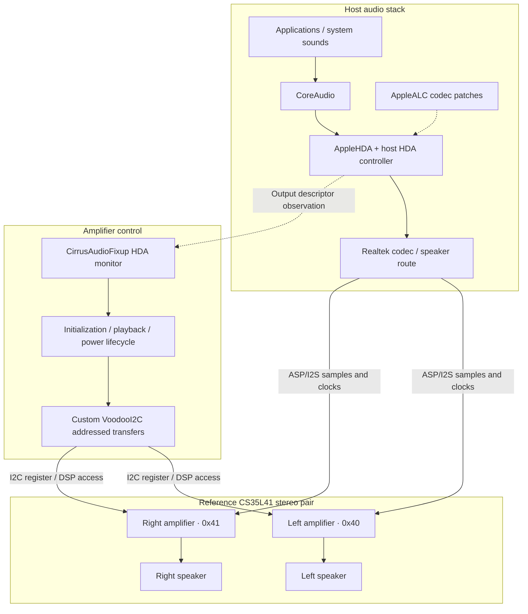
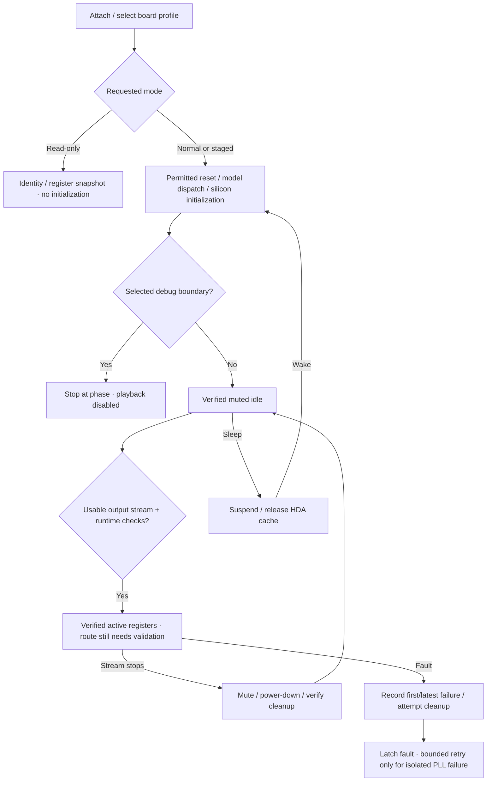

<div align="center">

# CirrusAudioFixup

[](https://github.com/hoaug-tran/CirrusAudioFixup/actions/workflows/build.yml)
[](#macos-compatibility)
[](#hardware-and-macos-scope)
[](#how-it-works)
[](LICENSE)

**Open-source macOS kernel extension for Cirrus Logic CS35L41 smart speaker amplifiers over I2C.**

Reference platform: **Lenovo Legion 7 16ACHg6 · Realtek ALC287 · AMD**

[Quick start](#installation) • [Hardware status](#hardware-and-macos-scope) • [How it works](#how-it-works) • [Boot arguments](#boot-arguments) • [Diagnostics](#diagnostics) • [Documentation hub](#documentation-hub)

</div>

---

CirrusAudioFixup is an x86_64 macOS kernel extension for the I2C-connected CS35L41 speaker amplifiers used by the reference Lenovo Legion configuration. It handles amplifier setup, firmware upload and playback power transitions. AppleALC and the host audio driver still provide the audio device and PCM route.

> [!CAUTION]
> **Hardware and speaker safety**
>
> Incorrect boost settings or speaker tuning can damage the hardware. Keep a known-good EFI, begin at low volume, and read the [bring-up guide](docs/safe_bringup_protocol.md) before testing a new configuration. DSP bypass removes acoustic protection; it is not a safe default for an unknown board.

> [!IMPORTANT]
> **Free and non-commercial software**
>
> See [LICENSE](LICENSE) for distribution terms. Do not sell the software or include it in paid EFI bundles. Paid system-setup services are permitted when no fee is charged for this software itself.

---

## Table of contents

- [Why this kext exists](#why-this-kext-exists)
- [Hardware and macOS scope](#hardware-and-macos-scope)
  - [macOS compatibility](#macos-compatibility)
  - [Tahoe: restore the host audio stack](#tahoe-restore-and-validate-the-host-audio-stack-first)
- [Installation](#installation)
- [How it works](#how-it-works)
  - [What the driver does](#what-the-driver-does)
- [Boot arguments](#boot-arguments)
- [Diagnostics](#diagnostics)
- [Debug and Release builds](#debug-and-release-builds)
- [Building and testing](#building-and-testing)
- [Documentation hub](#documentation-hub)
- [Troubleshooting guide](#troubleshooting-guide)
- [Porting another board or amplifier](#porting-another-board-or-amplifier)
- [Sources and license](#sources-and-license)

---

## Why this kext exists

On the reference Legion, the onboard Realtek codec supplies digital audio to two CS35L41 amplifiers. Configuring the codec alone does not initialize the amplifier power stages or load their DSP firmware.

The two paths have different responsibilities:

| Path | Owner | Responsibility |
| :--- | :--- | :--- |
| Host audio and codec route | AppleHDA + AppleALC | Expose the audio device and configure the PCM route |
| Amplifier control | CirrusAudioFixup + custom VoodooI2C | Reset, register access, firmware, tuning and playback power transitions |
| Audio signal | Codec ASP/I2S connection | Carry sample data and clocks to the amplifiers |

CirrusAudioFixup observes the host output stream and manages the amplifier lifecycle. It does not replace the codec driver or implement Lenovo/Nahimic user-space effects.

---

## Hardware and macOS scope

The implemented backend is CS35L41. The current personality matches a `VoodooI2CDeviceNub` whose `IOName` is `CLSA0100`.

| Configuration | What the source currently provides |
| --- | --- |
| Lenovo Legion 7 16ACHg6, SSID `17AA:3847` | Reference stereo profile, AMD `AMDI0030` reset quirk, embedded firmware and left/right tuning |
| Lenovo Legion 5 Pro 16ACH6H, SSID `17AA:382B` | Explicit translation to the `17AA:3847` resource; validate speaker and boost equivalence on the actual machine |
| `CLSA0101` / `CSC3551` | Staged profiles with automatic initialization disabled; no shipped matching personality |
| Other Intel or AMD boards | Porting required: provider, reset wiring, audio route, boost circuit and tuning must be verified |
| CS35L45 / CS35L51 / CS35L56 / other amplifier models | No implemented backend; unknown models are rejected before initialization |
| Realtek ALC codecs | Managed by AppleALC and the host audio stack, not by this kext |

Current profiles permit two endpoints: left `0x40` and right `0x41`. Four state slots are reserved in the service, but four-channel playback is not supported. The channel field selects ASP slots and speaker tuning.

The HDA gate accepts 48 kHz stereo PCM with 16-, 20- or 24-bit samples. The amplifier uses fixed ASP slot timing. A 44.1 kHz *hardware stream* is rejected; CoreAudio may resample a 44.1 kHz source before it reaches HDA.

### macOS compatibility

Both Xcode configurations target macOS 11.0 and build only for x86_64. This is a build target, not a claim that every OS and board combination has passed playback testing.

| macOS | Compatibility status |
| --- | --- |
| Big Sur 11 | Deployment target; target-machine load, playback and power testing still required |
| Monterey 12 | Compatibility target; target-machine validation still required |
| Ventura 13 | Original deployment floor; the current changes still need target-machine validation |
| Sonoma 14 | Compatibility target; target-machine validation still required |
| Sequoia 15 | Compatibility target; target-machine validation still required |
| Tahoe 26 | Conditional target; the AppleHDA dependency needs a working, validated solution |

[MacKernelSDK](https://github.com/acidanthera/MacKernelSDK) supports targeting older XNU kernels with current Xcode. The source uses IOKit/KPI dependencies at the Big Sur generation. Building against those headers does not prove that a kext loads, that its transport works, or that speakers play on a particular OS.

### Tahoe: restore and validate the host audio stack first

[AppleALC upstream](https://github.com/acidanthera/AppleALC#features) notes that macOS 26 removed AppleHDA in DP2. For the AppleHDA/AppleALC route used by this project, restore a compatible AppleHDA using a patch maintained for your exact OS build, then verify that AppleHDA and AppleALC load and the codec exposes the intended speaker route. Having AppleHDA on disk is not sufficient.

[Dortania's Tahoe guide](https://github.com/dortania/OpenCore-Install-Guide/blob/master/extras/tahoe.md) describes AppleHDA restoration and the security/root-volume caveats. OCLP and community patches are external audio-stack solutions, not dependencies installed or validated by CirrusAudioFixup. Upstream OCLP targets supported Mac models; do not assume its patch policy applies unchanged to a Hackintosh. Follow the patch project's requirements and recheck the audio stack after an OS update. This README does not prescribe SIP changes or a particular patch bundle.

CirrusAudioFixup's PCI fallback can locate an HDA controller, but cannot replace AppleHDA, create a CoreAudio device or program the codec route. A restored host stack makes Tahoe a feasible test target; it does not establish tested amplifier support on every Intel or AMD system.

VoodooHDA with CirrusAudioFixup has not been tested. A running HDA descriptor alone does not establish compatible codec routing, BCLK, ASP timing or power transitions. No compatibility or incompatibility claim is made for that combination.

Tahoe still lists [supported Intel Macs](https://support.apple.com/en-us/122867). AMD systems separately depend on suitable OpenCore CPU patches; [AMD Vanilla](https://github.com/AMD-OSX/AMD_Vanilla#supported-macos-versions) lists Big Sur through Tahoe. Neither fact establishes amplifier compatibility on an arbitrary Intel or AMD laptop. Apple silicon and native AMD macOS support are outside this project's scope.

---

## Installation

For a new build, use the artifacts for the exact commit you intend to test, or a versioned [release](https://github.com/hoaug-tran/CirrusAudioFixup/releases). Do not mix a Debug kext and symbols from different commits.

> [!NOTE]
> **Prebuilt bundle and current artifacts**
>
> The checked-in [docs/Kexts.zip](docs/Kexts.zip) is a historical bundle. Its plists contain CirrusAudioFixup 1.0.0, AppleALC 1.9.9 and VoodooI2C 2.9.1. It does not contain the current 1.0.1 changes, and its version numbers do not establish compatibility with another macOS release.

### Required components

| Component | Role |
| :--- | :--- |
| Lilu 1.7.2 or newer + AppleALC | Lilu is a direct link dependency for audio event hooks; AppleALC patches the codec in a compatible AppleHDA stack |
| Custom VoodooI2C | Addressed amplifier transfers through `VoodooI2CTransferToAddress` |
| CirrusAudioFixup | CS35L41 initialization and playback power control |
| VirtualSMC | Part of the wider Hackintosh setup, not a direct driver link dependency |

> [!WARNING]
> **Custom I2C transport required**
>
> Use [hoaug-tran/VoodooI2C](https://github.com/hoaug-tran/VoodooI2C). A provider without the addressed platform function cannot carry this driver's amplifier transactions. Preserve the controller/plugins needed by your machine; this is not an instruction to remove unrelated I2C plugins.

### OpenCore configuration

Prepare the existing OpenCore audio stack:

1. Install a compatible Lilu and AppleALC build for your OS. VirtualSMC belongs to the wider Hackintosh setup.
2. Install the [custom VoodooI2C fork](https://github.com/hoaug-tran/VoodooI2C) that implements the addressed `VoodooI2CTransferToAddress` platform function. Keep the controller and plugin configuration required by that fork and your machine.
3. Add CirrusAudioFixup after VoodooI2C in `Kernel -> Add`. Each entry needs the correct bundle, executable and plist paths.
4. Make sure the amplifier nub appears in the IOService plane with `IOName=CLSA0100`. Do not assume every laptop places it under the same ACPI path.
5. Configure the reference ALC287 route with `alcid=16`, or the equivalent four-byte `layout-id` value `10 00 00 00`. Other codecs and boards need their own route.

CirrusAudioFixup directly depends on Lilu for its IOAudioFamily event hooks. AppleALC also requires Lilu. The custom I2C provider is accessed through a platform function, not a linked `VoodooI2CTransferToAddress` symbol.

Begin with `-cirrusro -cirrusdbg` when checking a new installation. Confirm the provider, silicon identity and resource selection before allowing initialization or playback. See the [bring-up guide](docs/safe_bringup_protocol.md) for stage-by-stage checks.

---

## How it works

The control bus configures the amplifiers. Audio samples reach them through the codec's serial audio connection, not through the driver's I2C transfers.


```mermaid
flowchart TD
    subgraph Host["Host audio stack"]
        Apps["Applications / system sounds"] --> Audio["CoreAudio"]
        Audio --> HDA["AppleHDA + host HDA controller"]
        ALC["AppleALC codec patches"] -.-> HDA
        HDA --> Codec["Realtek codec / speaker route"]
    end

    subgraph Control["Amplifier control"]
        HDA -.->|Output descriptor observation| Watcher["CirrusAudioFixup HDA monitor"]
        Watcher --> Lifecycle["Initialization / playback / power lifecycle"]
        Lifecycle --> I2C["Custom VoodooI2C addressed transfers"]
    end

    subgraph Speakers["Reference CS35L41 stereo pair"]
        Left["Left amplifier · 0x40"] --> LS["Left speaker"]
        Right["Right amplifier · 0x41"] --> RS["Right speaker"]
    end

    Codec -- "ASP/I2S samples and clocks" --> Left
    Codec -- "ASP/I2S samples and clocks" --> Right
    I2C -- "I2C register / DSP access" --> Left
    I2C -- "I2C register / DSP access" --> Right
```

### What the driver does

During startup, the service selects a board profile, validates the requested debug phase and performs the permitted board reset. Read-only and probe-only modes skip that reset. Silicon identity is checked before initialization.

Initialization dispatches by model. The CS35L41 path resets the chip, waits for OTP boot, applies trim and errata, configures clocks and ASP, selects channel tuning, uploads firmware and checks the DSP. It finishes in verified muted idle. No other model is routed through that sequence.

HDA stream checks validate controller state, stream tag and format; multiple running output streams are treated as ambiguous. IOAudioFamily events control recognized output transitions. The compatibility timer uses 100 ms for a running stream and 50 ms otherwise. The retained PCI service and BAR mapping are reused until suspend, removal, invalid topology or teardown.

Runtime preparation and cleanup advance through a CS35L41 state machine.
Pending acknowledgements use a 1 ms timer and monotonic deadlines, without
sleeping inside the monitor. Both endpoints must be prepared before output
is unmuted; a failed commit rolls back the pair. Recognized headphone idle
stops the timer after bounded cleanup. I2C calls remain synchronous, and PM
quiesce and firmware initialization still use their synchronous paths.
See the [runtime transition design](docs/runtime_transition_design.md).

Playback requires more than HDA RUN. The monitor verifies PLL, DSP/mailbox, power acknowledgements and output registers before marking a channel active. Stream loss, read failures and protection faults trigger cleanup. Most faults remain latched. An isolated PLL failure can retry after a cooldown, at most three times before a successful start resets the retry count.

Sleep and stop share the workloop gate with the timer. Suspend attempts mute, power-down and DSP halt, then releases the HDA cache. Wake repeats software-reset initialization and firmware staging. It does not repeat the board GPIO reset performed by `start()`.

Output switching uses IOAudioFamily events when both hooks and the built-in output selector are available. The driver observes completed selector updates and engine state changes. It keeps the original handlers and schedules amplifier work on its own workloop.

Selecting headphones or stopping the engine mutes the speakers and stops the periodic timer. Selecting internal speakers starts preparation without the previous recovery cooldown. Stream readiness has up to 40 short retry intervals; hardware operations have their own bounded waits. Active speaker playback retains periodic protection checks.

`Cirrus_Audio_Event_Mode` reports `IOAUDIO_FAMILY_EVENTS`, `IOAUDIO_HOOKS_WAITING_FOR_OUTPUT`, or `HDA_TIMER_FALLBACK`. The current event binding recognizes `ispk` and `hdpn` on one built-in engine. Other selector identities or unavailable hooks retain the HDA timer fallback. Event hooks and audible switching latency still need target-machine validation.

Register and heartbeat checks do not measure the PCM signal, speaker excursion or audible output. A successful verdict must still be checked against the actual route and speakers.

### Driver execution lifecycle


```mermaid
flowchart TD
    Attach["Attach / select board profile"] --> Mode{"Requested mode"}
    Mode -- "Read-only" --> Snapshot["Identity / register snapshot · no initialization"]
    Mode -- "Normal or staged" --> Init["Permitted reset / model dispatch / silicon initialization"]
    Init --> Stage{"Selected debug boundary?"}
    Stage -- "Yes" --> Halt["Stop at phase · playback disabled"]
    Stage -- "No" --> Idle["Verified muted idle"]
    Idle --> Gate{"Usable output stream + runtime checks?"}
    Gate -- "Yes" --> Active["Verified active registers · route still needs validation"]
    Active -- "Stream stops" --> Cleanup["Mute / power-down / verify cleanup"]
    Cleanup --> Idle
    Active -- "Fault" --> Fault["Record first/latest failure / attempt cleanup"]
    Fault --> Policy["Latch fault · bounded retry only for isolated PLL failure"]
    Idle -- "Sleep" --> Suspend["Suspend / release HDA cache"]
    Suspend -- "Wake" --> Init
```

The diagram summarizes the normal lifecycle; named debug phases can stop within initialization. Read-only and `probe` phase skip board reset. Wake repeats software initialization, not the startup GPIO toggle.

---

## Boot arguments

Flags with a value of `0` are treated as disabled. Debug builds enable routine logging by default; `-cirrusdbg=0` does not override that build default.

| Argument | Actual behavior |
| --- | --- |
| `-cirrusoff` | Reject attachment before hardware initialization |
| `-cirrusdbg` | Enable routine `IOLog` messages in Release; already enabled by default in Debug |
| `-cirrusro` | Skip GPIO reset, initialization and register writes; collect a one-shot register snapshot. Reads still send an I2C register-address prefix |
| `-cirrusnodsp` | Skip firmware and coefficient upload; use the explicit DAC bypass path without DSP acoustic protection |
| `-cirrusphase=<name>` | Stop after a selected initialization stage; playback stays disabled |
| `-cirruslegacyprobe` | Permit fixed-address discovery outside automatic profile policy; diagnostic use only, not evidence of board support |
| `-cirrusprobe` | Record the flag in `CirrusBootArgParsed`; currently does not enable a separate transaction-log mode |
| `-cirrusdelay=<ms>` | Set the read-only snapshot delay, default 100 ms. Does not replace the normal 15 ms startup wait |
| `-cirrusdiag` | Enable additional initialization register snapshots and CRC checks; essential runtime checks remain active without it |
| `-cirruscompact` | Shorten register snapshot text by omitting register names; the readable-register set is unchanged |
| `-cirrusdumptrace` | Publish `Cirrus_Trace_Dump` during the read-only snapshot. Failure trace properties are captured separately |
| `-cirrusnocal` | Skip measured calibration injection. Firmware and channel tuning still upload in DSP mode |
| `-cirrusssid=<value>` | Override the detected subsystem ID for resource selection; does not verify speaker compatibility |
| `-cirrusspkid=<value>` | Override speaker ID selection; the embedded reference resource uses speaker ID 1 |
| `-cirruscalr0=<value>` | Fallback measured R0 value for either channel when no EFI calibration is available |
| `-cirruscalr0l=<value>` | Left-channel measured R0 override; takes precedence over the shared value |
| `-cirruscalr0r=<value>` | Right-channel measured R0 override; takes precedence over the shared value |
| `-cirruscalstatus=<value>` | Calibration status for boot-argument calibration, default 1 |
| `-cirruscalambient=<value>` | Required measured ambient value when supplying R0 through boot arguments |

Valid phases are `probe`, `otp`, `errata`, `clock`, `asp`, `gpio`, `platform`, `firmware` and `dsp`. Unknown names, including legacy numeric phase names, reject startup before reset. The `firmware` phase stops before DSP boot; the `dsp` phase halts the core after boot checks.

Calibration values must come from the hardware's calibration procedure and use the firmware's units. Do not copy an impedance value from another laptop. Missing measured calibration is reported as `NOT_AVAILABLE`; `READY_DSP` does not certify measured calibration or validate the acoustic tuning.

---

## Diagnostics

Inspect the driver service, not just its ACPI device:

```bash
ioreg -lw0 -p IOService -r -c CirrusAudioFixup
sudo /usr/bin/log show --last 1h --style syslog --info --debug --predicate 'eventMessage CONTAINS "CirrusAudioFixup"'
sudo /usr/bin/log stream --level debug --style syslog --predicate 'eventMessage CONTAINS "CirrusAudioFixup"'
```

The first log command reads the retained last hour; adjust the interval if needed. The second watches new messages until Ctrl-C. Neither recreates messages that were not retained. Empty `ioreg` output means no matching service was found, not a successful health check. Release routine messages require `-cirrusdbg` at boot. Use the collector and its kernel-buffer fallback when the unified log is empty. See [diagnostic collection and audio feedback](docs/diagnostics.md) for expected results and microphone-pop checks.

The `Cirrus_Build_Configuration` property identifies Debug or Release. CI bundle plists also carry the build commit and configuration. Check them when comparing logs or reporting a panic.

| Driver verdict | Meaning |
| --- | --- |
| `READY_DSP` | Present amplifiers passed initialization and DSP checks; audible output and measured calibration remain separate |
| `READY_BYPASS_EXPLICIT` | Initialization completed with explicit DSP bypass; acoustic protection is absent |
| `DEBUG_PHASE_HALTED` | Initialization stopped at the requested debug boundary; playback is disabled |
| `FAULT_LATCHED` | An initialization, I/O, DSP, protection or playback fault is retained |
| `FAILED_INIT` | Initialization readiness was not established |
| `OUTPUT_DISABLED_DSP_UNVERIFIED` | Initialization state does not establish a usable DSP or explicit bypass |
| `READ_ONLY` | Diagnostic attachment without initialization or register writes |
| `SUSPENDED` | Service is in its low-power state |

Per-channel `Cirrus_Playback_Verdict_left/right` values describe playback:

- `SAFE_IDLE_VERIFIED`: the driver's idle register checks passed.
- `ACTIVE_REGISTERS_VERIFIED_ROUTE_UNCONFIRMED`: active register checks passed; downstream routing and sound remain unconfirmed.
- `CLEANUP_UNVERIFIED`: cleanup did not establish the expected idle state.
- `FAULT_LATCHED_OUTPUT_DISABLED`: a fault remains and output cleanup was verified.

Read `Cirrus_Diag_FirstFailure_*`, `Cirrus_Diag_LatestFailure_*`, `Cirrus_HDA_Status` and the trace properties together. The first failure records the original problem; a later cleanup failure must not replace it. The full failure list lives in [DiagnosticTypes.hpp](CirrusAudioFixup/Diagnostics/DiagnosticTypes.hpp).

Collect evidence before rebooting:

```bash
sudo bash Tools/collect_macos.sh
```

Run this from the repository root on the affected macOS installation. The script prints its output directory and records command exit codes and empty output in `status.txt`; it does not create a ZIP archive. Some optional tools or properties can be absent. Review collected NVRAM and hardware identifiers before sharing them. A missing controller, unsupported format or ambiguous stream should be investigated in the audio stack before forcing another firmware SSID.

---

## Debug and Release builds

The two builds intentionally use the same hardware sequencing, checks, fault recorder and recovery limits. Do not remove safety checks or allow additional boost settings in Release.

| Setting | Debug | Release |
| --- | --- | --- |
| Compiler optimization | `-O0` | `-Os` |
| Routine logging at attachment | Enabled | Disabled; enable with `-cirrusdbg` |
| Error logging | Enabled | Enabled |
| Deep register diagnostics | Explicit `-cirrusdiag` | Explicit `-cirrusdiag` |
| Debug information | Matching dSYM | Matching dSYM for optimized code |
| Installed-product stripping | Disabled | Disabled |
| Hardware safety checks | Unchanged | Unchanged |

CI verifies binary/dSYM UUIDs and packages symbols separately in `SYMBOLS.zip`. Keep the symbols for the exact build; an optimized Release panic still needs matching symbols. There are no Debug-only panic assertions in the current driver.

Branch pushes produce test artifacts. Public releases require a new matching `vX.Y.Z` tag, plist versions and changelog entry. Versioned assets include checksums and build metadata. Existing releases are not overwritten.

---

## Building and testing

Use Xcode on macOS and the configured [MacKernelSDK](https://github.com/acidanthera/MacKernelSDK). From the repository root:

Clone the same SDK revision used by CI once, before building:

```bash
git clone https://github.com/acidanthera/MacKernelSDK.git MacKernelSDK
git -C MacKernelSDK checkout --detach 7af1933c27aefcbdf4809ee44478829aad30f9c1
git clone https://github.com/acidanthera/Lilu.git Lilu
git -C Lilu checkout --detach e4748cc081bf060302c7d3c44a643ce1d11b7e1d
```

If an SDK checkout already exists, inspect its state before changing its revision. The project uses its kernel headers and x86_64 libkmod rather than the SDK bundled with Xcode.

```bash
xcodebuild -project CirrusAudioFixup.xcodeproj \
  -target CirrusAudioFixup -configuration Release -sdk macosx \
  CODE_SIGNING_REQUIRED=NO CODE_SIGN_IDENTITY="" CODE_SIGNING_ALLOWED=NO \
  CONFIGURATION_BUILD_DIR="$PWD/build/Release" build
```

Repeat with `Debug` and `build/Debug` for the diagnostic build. These are unsigned OpenCore-injection artifacts, not a standalone macOS installer.

Host tests require Python 3, Bash and a C++17 compiler available as `g++` (Bash is included with macOS; on Windows the tools test uses Git for Windows Bash):

```bash
python3 Tests/reproduce_host.py
python3 Tests/check_registers.py
python3 Tests/check_transport.py
python3 Tests/check_diagnostics.py
python3 Tests/check_hda.py
python3 Tests/check_calibration.py
python3 Tests/check_tuning.py
python3 Tests/check_windows_payloads.py
python3 Tests/check_bringup.py
python3 Tests/check_runtime.py
python3 Tests/check_audio_events.py
python3 Tests/check_architecture.py
python3 Tests/check_release.py
python3 Tests/check_build_policy.py
python3 Tests/check_tools.py
```

Injected failures deliberately print errors. Check each process's exit code and final PASS result. These tests exercise production code with mocked buses and IOKit objects; they cannot establish a real I2C transaction, loaded kext or speaker output.

Before declaring a board/OS combination supported, record the commit, macOS build, CPU/platform, audio codec/layout, VoodooI2C build and firmware/tuning identity. Test cold boot, quiet idle, low-volume stereo playback, repeated start/stop, headphone switching and sleep/wake. Capture both channel verdicts and first/latest failures. See [CONTRIBUTING.md](CONTRIBUTING.md).

The completed source fixes and remaining validation work are listed in [audit_status.md](docs/audit_status.md).

---

## Documentation hub

| Document | What to use it for |
| :--- | :--- |
| [Bring-up and diagnostic checks](docs/safe_bringup_protocol.md) | Read-only inspection, staged initialization, playback checks and fallback |
| [Diagnostic collection and audio feedback](docs/diagnostics.md) | Command results, microphone-pop evidence and loudness/DSP comparisons |
| [Audit status](docs/audit_status.md) | Addressed findings, verification boundaries and remaining work |
| [Linux parity audit](docs/linux_parity_audit.md) | Firmware, gain, lifecycle differences and remaining parity gaps |
| [Windows reference audit](docs/windows_driver_audit.md) | OEM payload identity, registry settings and disassembly evidence |
| [Runtime transition design](docs/runtime_transition_design.md) | Start/stop phases, stereo barrier, deadlines and completion boundaries |
| [Contributing](CONTRIBUTING.md) | Hardware evidence, code conventions, tests and release requirements |
| [Changelog](CHANGELOG.md) | Source changes by version |
| [Historical prebuilt bundle](docs/Kexts.zip) | Archived components; not the current source build |
| [Reference EFI](https://github.com/hoaug-tran/Lenovo-Legion-7-16ACHG6-Hackintosh) | Legion board configuration and project context |

---

## Troubleshooting guide

### Internal speakers remain silent

1. Confirm the intended host output device and codec layout. On Tahoe, validate the restored AppleHDA stack first.
2. Check that the custom I2C provider is loaded and that the CirrusAudioFixup service appears in IOService.
3. Inspect both channels' verdicts and first/latest failures. HDA RUN or `READY_DSP` alone does not prove speaker output.
4. Save the collector report before rebooting. Do not force another laptop's SSID or raise gain to bypass an unexplained failure.

### Speakers pop when the microphone opens

This is a reported first-activation symptom, not an established layout-id or kext defect. Follow the [microphone transition checks](docs/diagnostics.md#first-microphone-activation-causes-a-speaker-pop) and compare timestamped pre/post state. Stop if the pop is loud; do not repeatedly reproduce it at high volume.

### Sound is louder without DSP or another component

Identify exactly what was disabled. The same volume slider position does not establish matched acoustic levels. Firmware tuning, amplifier gain and user-space effects affect different parts of the chain. See [loudness, EQ and DSP bypass](docs/diagnostics.md#louder-sound-eq-and-dsp-bypass). Bypass is not a recommended permanent fix.

### No sound after sleep or wake

Collect the service properties and logs after wake, before another reboot. Compare the power state, initialization verdict, HDA status and both channels' first/latest failures. Wake must re-establish the software initialization and firmware state; a retained controller or an output descriptor alone is insufficient.

> [!TIP]
> **One report, both channels**
>
> Run `sudo bash Tools/collect_macos.sh` from the repository root. Keep `status.txt` and the raw files together. Empty query output is evidence to investigate, not a successful health check.

---

## Porting another board or amplifier

Start with read-only evidence from macOS and a working Linux configuration. Record ACPI HID, I2C endpoints, silicon/revision, HDA subsystem ID, reset wiring, boost topology and speaker/tuning IDs.

For CS35L41, add a board profile and matching personality only after checking that evidence. An SSID override alone is not a port. Validate the reference audio route and each channel separately.

The import utility uses `--bin-l` and `--bin-r`. Validate first:

Firmware and tuning are compiled into the kext executable. Runtime does not read
firmware from the EFI partition or macOS filesystem and does not require a helper.
This packaging choice does not remove the Lilu, I2C-provider or host-audio dependencies.

```bash
python3 Tools/import_firmware.py --codec cs35l41 --ssid 0x103C89B5 \
  --wmfw path/to/cs35l41-dsp1-spk-prot-103c89b5.wmfw \
  --bin-l path/to/left.bin --bin-r path/to/right.bin \
  --spkid 1 --validate-only
```

Replace the example SSID and every `path/to/...` argument with your actual resource identity and files. This checks basic container headers and alignment, not complete block parsing, DSP identity, board compatibility or runtime validation. Invalid right-channel input must fail just like invalid left-channel input. Omitting `--bin-r` deliberately reuses left-channel tuning; do that only when the source profile specifies identical tuning. Review the import utility before using its write mode and keep a recoverable source commit.

If the matching Linux profile provides companion gain parameters, add
`--bincfg-l path/to/left.bincfg --bincfg-r path/to/right.bincfg` to that command.
These paths are build-time inputs, not installation paths. The CS35L41 parser
checks the signature, version, sizes, entry count and gain range before import.
Each channel's omitted companion uses the Linux default PCM gain code 17.
Unlike BIN reuse, a missing right BINCFG never inherits the left gain override.
Remove `--validate-only` to import a new profile after reviewing its identity.
Existing board/speaker entries and resource symbols reject import without changes;
replace an existing profile explicitly in source after reviewing its resources.
Generated arrays carry SHA-256 comments for byte identity, not proof of authenticity.

For another amplifier model, implement its identity, register access, reset/trim, clocks, power, DSP and playback lifecycle before adding it to the supported registry. Add its own dispatch case; never send a new chip through `initializeCS35L41()`. The monitor and firmware selection are still CS35L41-specific and also need separate backend handling before another model can be enabled.

---

## Sources and license

The [volume, EQ and calibration audit](docs/acoustic_parity_audit.md) separates
embedded DSP tuning from host volume and Nahimic effects. It records OEM payload
comparisons, calibration validation and the limits of acoustic parity claims.

The [Windows reference audit](docs/windows_driver_audit.md) records byte-identical
OEM firmware and Veco left/right coefficients for the `17AA3847 / spkid1` profile.
The OEM configured gain is also 17.5 dB. These checks establish resource identity,
not matching Windows effects, volume curves or measured acoustic output.

Register definitions and sequencing draw on the Linux CS35L41 HDA/ASoC drivers. This is a macOS port with board-specific behavior, not a claim of bit-for-bit parity with every upstream path. Firmware and tuning resources are embedded in [Firmware.hpp](CirrusAudioFixup/Devices/CS35L41/Resources/Firmware.hpp); preserve their provenance and applicable licenses when replacing them.

See the [CS35L41 parity audit](docs/linux_parity_audit.md) for corrected reset/unmute values and remaining differences. DSP playback uses Linux's default PCM gain of 17.5 dB unless its selected channel has an embedded `.bincfg` override. Digital amplifier volume stays at 0 dB. The existing reference resource has no companion gain override. The Windows OEM effects chain is not reproduced or verified here. A matching volume-slider position does not establish equal loudness or EQ.

See [LICENSE](LICENSE) for the non-commercial distribution terms. Paid system-setup services are permitted under the license when no fee is charged for this software itself; selling the software or paid EFI bundles is not.

Maintained by [Tran Kinh Hoang](https://github.com/hoaug-tran). Thanks to the VoodooI2C team, Acidanthera, Cirrus Logic and the Linux audio maintainers for their code and documentation. The [reference EFI](https://github.com/hoaug-tran/Lenovo-Legion-7-16ACHG6-Hackintosh) and its [historical audio issue](https://github.com/hoaug-tran/Lenovo-Legion-7-16ACHG6-Hackintosh/issues/2) provide board context, not a validation matrix for every macOS release.
