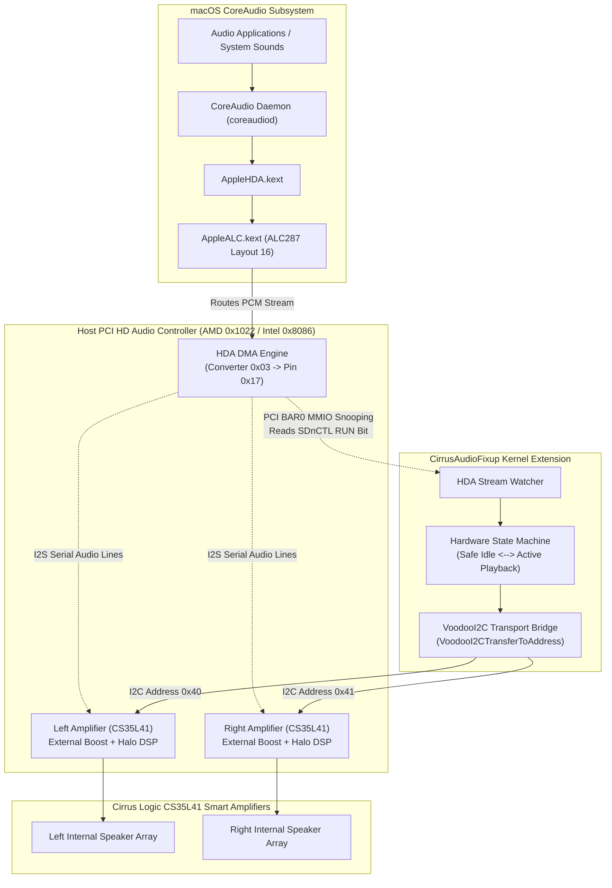

# CirrusAudioFixup

<div align="center">

[](#building-from-source-and-host-testing)
[](#prerequisites-and-system-requirements)
[-brightgreen?style=flat-square)](#current-hardware-support-status)
[](#how-it-works)
[](LICENSE)

**Open-source macOS kernel extension enabling Cirrus Logic CS35L41 smart amplifiers over I2C on modern laptops.**

[Quick start](#quick-start-prebuilt-kext-bundle) • [Hardware status](#current-hardware-support-status) • [How it works](#how-it-works) • [Safety protocol](#4-phase-progressive-bring-up-protocol) • [Boot arguments](#boot-arguments-reference) • [Documentation hub](#documentation-hub) • [Diagnostics](#telemetry-and-diagnostics) • [Troubleshooting](#troubleshooting-guide)

</div>

---

> [!CAUTION]
> **Hardware and speaker safety notice:**  
> This driver directly configures amplifier output stages, external boost power converters, and DSP acoustic protection algorithms. Incorrect register configurations, mismatched firmware profiles, or forced voltage settings can cause thermal runaway or permanently damage internal speaker voice coils. Always follow the [progressive bring-up protocol](#4-phase-progressive-bring-up-protocol).

> [!IMPORTANT]
> **Free and non-commercial software:**  
> This project is 100% free under the [CirrusAudioFixup Non-Commercial Software Distribution License](LICENSE). It is strictly forbidden to sell this software, include it in paid EFI packs, or lock it behind commercial services. If you paid for this driver, you were scammed.

---

## Table of contents

- [Why this kext exists](#why-this-kext-exists)
- [Current hardware support status](#current-hardware-support-status)
  - [Audio subsystem operational matrix](#audio-subsystem-operational-matrix)
- [Quick start: prebuilt kext bundle](#quick-start-prebuilt-kext-bundle)
- [How it works](#how-it-works)
  - [Driver execution lifecycle](#driver-execution-lifecycle)
- [Linux driver lineage and register parity](#linux-driver-lineage-and-register-parity)
- [Prerequisites and system requirements](#prerequisites-and-system-requirements)
- [Installation and configuration guide](#installation-and-configuration-guide)
  - [1. Required kexts](#1-required-kexts)
  - [2. OpenCore kext load order](#2-opencore-kext-load-order)
  - [3. AppleALC layout configuration](#3-applealc-layout-configuration)
  - [4. Progressive safety protocol](#4-phase-progressive-bring-up-protocol)
- [Boot arguments reference](#boot-arguments-reference)
- [Telemetry and diagnostics](#telemetry-and-diagnostics)
  - [Checking runtime health in IORegistry](#checking-runtime-health-in-ioregistry)
  - [Driver verdict reference](#driver-verdict-reference)
  - [Playback verdict reference](#playback-verdict-reference)
  - [Diagnostic failure codes](#diagnostic-failure-codes)
  - [Live kernel log streaming](#live-kernel-log-streaming)
  - [Automated evidence collector](#automated-evidence-collector)
- [Documentation hub](#documentation-hub)
- [Troubleshooting guide](#troubleshooting-guide)
- [Adding support for other laptops](#adding-support-for-other-laptops)
- [Building from source and host testing](#building-from-source-and-host-testing)
  - [Release vs. debug packages](#release-vs-debug-packages)
  - [Compiling with Xcode CLI](#compiling-with-xcode-cli)
  - [Running the host test suite](#running-the-host-test-suite)
- [License and credits](#license-and-credits)

---

## Why this kext exists

On most modern PC laptops (including Lenovo Legion, ASUS ROG, Dell XPS, and HP Omen series), internal laptop speakers are no longer wired directly to the analog output pins of the onboard Realtek High Definition Audio (HDA) codec.

Instead, manufacturers route digital audio through dedicated smart amplifier chips—such as dual **Cirrus Logic CS35L41** amplifiers:
- **Control bus**: Amplifiers communicate over an auxiliary I2C bus (`CLSA0100` or `CSC3551` in ACPI).
- **Audio data bus**: Audio data travels over an Inter-IC Sound (I2S) or Audio Serial Port (ASP) connection synchronized to the Realtek codec's High Definition Audio bit clock.
- **Internal DSP & boost converter**: Each amplifier contains an integrated external/internal boost converter (stepping battery voltage up to 11V–17V) and an embedded 32-bit Halo DSP core running Cirrus Sound Protection Lite (CSPL) firmware for real-time speaker excursion and thermal limiting.

### The problem on macOS

Standard Hackintosh audio setups rely on `AppleALC.kext` to patch Apple's native `AppleHDA.kext`. While AppleALC successfully drives the Realtek codec (restoring the 3.5mm headphone jack, internal microphones, and HDMI/DisplayPort audio), **the internal laptop speakers remain completely silent**.

This happens because the CS35L41 amplifiers remain stuck in reset or low-power shutdown. To output sound, they require:
1. Low-level platform GPIO hardware reset deassertion.
2. Initial I2C bus configuration, OTP trim memory decoding, and silicon revision B2 errata workarounds.
3. External boost converter rail bring-up and PLL clock locking.
4. Parsing and uploading Cirrus WMFW v2 firmware and per-speaker coefficient calibration binaries to the Halo DSP.
5. Dynamic synchronization with the system audio stream so the power stages smoothly ramp up when sound starts and soft-mute before sleep or stream shutdown.

### What CirrusAudioFixup does

**CirrusAudioFixup** is an IOKit kernel extension matching `VoodooI2CDeviceNub` (`CLSA0100`). It provides:
- Complete I2C register management matching upstream Linux ALSA/ASoC kernel drivers bit-for-bit.
- Platform GPIO MMIO control for AMD controllers (`AMDI0030`) to assert and release hardware reset lines.
- Non-invasive PCI BAR0 snooping of the host HD Audio DMA engine to monitor stream descriptor states in real time.
- Embedded WMFW v2 firmware staging and speaker calibration injection (`.bin` files) with CRC32 integrity verification.
- Pop-free mailbox volume transitions using the Halo DSP soft-mute curve.
- Clean system sleep and wake power management integration.

---

## Current hardware support status

| Laptop Model | Subsystem ID (SSID) | Audio Codec | Amplifiers & I2C Addresses | Boost Type | Status | Reference EFI |
| :--- | :--- | :--- | :--- | :--- | :--- | :--- |
| **Lenovo Legion 7 16ACHg6 (2021)** | `17AA:3847` | Realtek ALC287 (`alcid=16`) | Dual CS35L41 (`0x40`, `0x41`) | External Boost | **Working** (DSP active) | [hoaug-tran/Lenovo-Legion-7-16ACHG6-Hackintosh](https://github.com/hoaug-tran/Lenovo-Legion-7-16ACHG6-Hackintosh) |
| **Lenovo Legion 5 Pro 16ACH6H (2021)** | `17AA:382B` | Realtek ALC287 (`alcid=16`) | Dual CS35L41 (`0x40`, `0x41`) | External Boost | **Working** (SSID auto-mapped) | Compatible with Legion 7 EFI |
| **Other CS35L41 / CSC3551 laptops** | _Various_ | ALC287 / ALC298 / ALC295 | CS35L41 / CS35L45 / CS35L51 | Internal / External | Porting required | See [Porting guide](#adding-support-for-other-laptops) |

> [!NOTE]
> **Resolves historical Legion 7 audio failure:**  
> This driver directly resolves the long-standing internal speaker shutdown tracked in [hoaug-tran/Lenovo-Legion-7-16ACHG6-Hackintosh#2](https://github.com/hoaug-tran/Lenovo-Legion-7-16ACHG6-Hackintosh/issues/2), restoring full hardware audio output for the Lenovo Legion 7 16ACHg6 and Legion 5 Pro 16ACH6H. Laptops carrying SSID `17AA:382B` share an identical acoustic layout and are automatically mapped to `17AA:3847` at runtime without requiring boot arguments.

### Audio subsystem operational matrix

To maintain complete transparency regarding hardware functionality on reference hardware (Lenovo Legion 7 / 5 Pro with Realtek ALC287 layout 16):

| Audio Endpoint | Driver Pipeline | Operational Status | Notes |
| :--- | :--- | :---: | :--- |
| **Internal Speakers** | CirrusAudioFixup + Custom VoodooI2C | **100% Working** | Full stereo clarity, pop-free mailbox soft-mute transitions, Halo DSP excursion protection, full dynamic range. |
| **Headphone Jack (3.5mm)** | AppleALC (ALC287 Layout 16) | **100% Working** | Native AppleHDA jack detection and automatic switching. |
| **Internal Microphone** | AppleALC (ALC287 Layout 16) | **Functional** (Tuning ongoing) | Operational on **Boost Level 1**. Boost 2 and 3 overdrive the analog input stage, causing harsh clipping and audio distortion. High-volume speech may experience slight static. |

---

## Quick start: prebuilt kext bundle

For end users who do not wish to compile multiple dependencies from source, the entire audio pipeline requires three coordinated kernel extensions:

1. **`CirrusAudioFixup.kext`**: Download the latest release from this repository's [Releases page](../../releases). Both `RELEASE` and `DEBUG` archives are provided.
2. **`VoodooI2C.kext` (Custom transport fork)**: Prebuilt with the `VoodooI2CTransferToAddress` export. Download from [hoaug-tran/VoodooI2C Actions](https://github.com/hoaug-tran/VoodooI2C/actions).
3. **`AppleALC.kext` (Layout 16 fork)**: Prebuilt with Realtek ALC287 layout-id 16. Available in the reference [Lenovo Legion 7 Hackintosh EFI](https://github.com/hoaug-tran/Lenovo-Legion-7-16ACHG6-Hackintosh).

---

## How it works

The diagram below illustrates how CirrusAudioFixup interacts with macOS CoreAudio, AppleALC, the PCI HD Audio controller, and the physical CS35L41 amplifiers:


```mermaid
flowchart TD
    subgraph CoreAudioLayer["macOS CoreAudio Subsystem"]
        UserApp["Audio Applications / System Sounds"] --> CoreAudio["CoreAudio Daemon (coreaudiod)"]
        CoreAudio --> AppleHDA["AppleHDA.kext"]
        AppleHDA --> AppleALC["AppleALC.kext (ALC287 Layout 16)"]
    end

    subgraph HDALayer["Host PCI HD Audio Controller (AMD 0x1022 / Intel 0x8086)"]
        AppleALC -->|Routes PCM Stream| HDADMA["HDA DMA Engine\n(Converter 0x03 -> Pin 0x17)"]
        HDADMA -.->|I2S Serial Audio Lines| AmpLeft
        HDADMA -.->|I2S Serial Audio Lines| AmpRight
    end

    subgraph FixupLayer["CirrusAudioFixup Kernel Extension"]
        HDADMA -.->|PCI BAR0 MMIO Snooping\nReads SDnCTL RUN Bit| HDAWatcher["HDA Stream Watcher"]
        HDAWatcher --> StateMachine["Hardware State Machine\n(Safe Idle <--> Active Playback)"]
        StateMachine --> CustomI2C["VoodooI2C Transport Bridge\n(VoodooI2CTransferToAddress)"]
    end

    subgraph HardwareLayer["Cirrus Logic CS35L41 Smart Amplifiers"]
        CustomI2C -->|I2C Address 0x40| AmpLeft["Left Amplifier (CS35L41)\nExternal Boost + Halo DSP"]
        CustomI2C -->|I2C Address 0x41| AmpRight["Right Amplifier (CS35L41)\nExternal Boost + Halo DSP"]
        AmpLeft --> SpkLeft["Left Internal Speaker Array"]
        AmpRight --> SpkRight["Right Internal Speaker Array"]
    end
```

### Driver execution lifecycle

The driver executes through five distinct operational phases:

#### 1. Platform reset and silicon bring-up
- Locates the AMD GPIO controller (`AMDI0030`) and directly drives the pin MMIO registers to assert and deassert the hardware reset line.
- Probes target I2C addresses (`0x40` left channel, `0x41` right channel, with expandability up to four channels `0x42`/`0x43`).
- Verifies the hardware silicon signature (`DEVID = 0x35A40`, `REVID = 0xB2`).
- Issues software reset (`SW_RESET = 0x00005A5A`) and waits for OTP boot memory to settle.
- Reads and unpacks OTP trim registers (`unpackOTP`), extracting factory voltage, current, and trim calibration parameters.
- Applies the Cirrus revision B2 errata sequence (`kCs35l41RevB2ErrataPatch`) under protected test key access.

#### 2. Clocks, ASP (I2S), and boost configuration
- Programs the Phase-Locked Loop (PLL) to derive internal clocks from the Realtek codec's bit clock (BCLK).
- Configures the Audio Serial Port (ASP) format: I2S mode, 48 kHz / 44.1 kHz sampling rate, 24-bit/32-bit slot width, channel assignments.
- Configures the boost converter rails. On Legion platforms, external boost sequencing registers (`0x742C` and `0x7438`) are activated to drive external DC-DC converter circuitry.

#### 3. Halo DSP firmware and calibration staging
- Inspects the system ACPI Subsystem ID (SSID) and matches it against embedded firmware tables.
- Parses WMFW v2 binary containers (`cirrus/cs35l41-dsp1-spk-prot-17aa3847.wmfw`), verifying chunk headers and uploading code segments directly to DSP Program Memory (PM), Data Memory (DM), and Zero Memory (ZM).
- Injects channel-specific coefficient calibration binaries (`.bin` files) into DSP coefficient memory for Left (`l0`) and Right (`r0`) speakers.
- Boots the Halo DSP core and verifies the runtime heartbeat counter register. If `-cirrusnodsp` is specified, this phase is bypassed and amplifiers run in direct DAC mode.

#### 4. Dynamic audio stream synchronization
- A high-resolution timer event source periodically inspects the host HD Audio PCI BAR0 MMIO space.
- When an audio application plays sound, macOS CoreAudio starts the HDA DMA engine. The stream descriptor control register (`SDnCTL`) sets its `RUN` bit.
- **Playback start sequence**:
  1. Driver detects `RUN = 1` and matches stream format.
  2. Unlocks test keys and sequences boost converter power up.
  3. Polls power management status until `PUP_DONE = 1`.
  4. Issues mailbox command `kCmdMailboxSpeakerOutputEnable` (`0x05`) to the Halo DSP.
  5. Ramps output volume smoothly to operating levels.
- **Playback stop sequence**:
  1. Driver detects `RUN = 0` or stream inactivity.
  2. Sends mailbox command `kCmdMailboxSpeakerOutputDisable` (`0x08`) to soft-mute speaker outputs without pops or clicks.
  3. Pauses the Halo DSP core (`kCmdMailboxPauseCore`).
  4. Powers down analog stages until `PDN_DONE = 1`.
  5. Enters low-power safe idle mode.

#### 5. Sleep and wake power management
- Integrates with macOS `IOPowerManagement`.
- When macOS enters system sleep (`setPowerState(0)`), the driver shuts down output stages, releases boost converter rails, and flags hardware for re-initialization.
- On system wake (`setPowerState(1)`), the driver repeats platform GPIO reset, silicon initialization, and firmware staging to restore speaker output.

---

## Linux driver lineage and register parity

CirrusAudioFixup was developed by reverse-engineering and adapting the official Linux kernel ALSA/ASoC drivers. Register definitions, bitfields, timing delays, and mailbox commands match upstream Linux code bit-for-bit:

| Linux Kernel Source File | Subsystem | Corresponding Component in CirrusAudioFixup |
| :--- | :--- | :--- |
| `sound/hda/codecs/side-codecs/cs35l41_hda.c` | ALSA HDA Side-Codec | State transitions (`safe_to_active` / `active_to_safe`), mailbox commands (`OUT_ENABLE`, `OUT_DISABLE`, `PAUSE`), and volume ramping. |
| `sound/hda/codecs/side-codecs/cs35l41_hda_property.c` | ACPI Property Parser | Platform quirks: `CS35L41_EXT_BOOST` power rail control, I2C addresses `0x40`/`0x41`, speaker ID indexing (`spkid=1`). |
| `sound/soc/codecs/cs35l41-lib.c` | Silicon Core Library | Hardware reset timing, OTP memory unpacking (`unpackOTP`), silicon revision B2 errata sequence (`kCs35l41RevB2ErrataPatch`), PLL locking, and ASP configuration. |
| `include/sound/cs35l41.h` | Kernel Definitions | Complete register map (`0x00000000`–`0x02BC3140`), IRQ masks, power status bits, and protection fault masks. |
| `sound/pci/hda/patch_realtek.c` & `alc269.c` | Realtek Codec Fixups | ALC287 initialization verbs, `ALC287_FIXUP_LEGION_16ACHG6` quirk, and clock synchronization between Realtek codec and CS35L41 amps. |
| `drivers/firmware/cirrus/wmfw.h` & `wm_adsp.c` | Halo DSP Subsystem | WMFW header decoding, chunk parsing (text, data, info), coefficient unpacking, and DSP memory distribution. |

> [!NOTE]
> **Firmware provenance:**  
> Embedded firmware binaries in `CirrusAudioFixup/Devices/CS35L41/Resources/Firmware.hpp` are sourced directly from [upstream linux-firmware](https://git.kernel.org/pub/scm/linux/kernel/git/firmware/linux-firmware.git):
> - `cirrus/cs35l41-dsp1-spk-prot-17aa3847.wmfw` (Cirrus Halo CSPL release `v6.39.0 / halo_cspl_RAM_revB2_29.41.0.wmfw`)
> - `cirrus/cs35l41-dsp1-spk-prot-17aa3847-spkid1-l0.bin` (Left channel speaker calibration)
> - `cirrus/cs35l41-dsp1-spk-prot-17aa3847-spkid1-r0.bin` (Right channel speaker calibration)

---

## Prerequisites and system requirements

- **Supported macOS versions**: macOS Ventura (13.x), macOS Sonoma (14.x), macOS Sequoia (15.x).
- **Bootloader**: OpenCore 0.9.8 or newer.
- **ACPI prerequisites**:
  - The I2C controller and amplifier ACPI device (`CLSA0100` or `CSC3551`) must be visible under `_SB.I2C0` in IORegistry.
  - Standard AMD/Intel DSDT patches for VoodooI2C (such as GPIO pin numbering or OSYS patches) must be present.
- **Custom VoodooI2C fork**:
  - Upstream VoodooI2C only exposes basic trackpad/touchscreen transfers. CirrusAudioFixup requires arbitrary 32-bit register reads/writes via the `VoodooI2CTransferToAddress` KPI.
  - You **must** use the custom fork from [hoaug-tran/VoodooI2C](https://github.com/hoaug-tran/VoodooI2C/actions).

---

## Installation and configuration guide

### 1. Required kexts

Download and copy the following kernel extensions into your `EFI/OC/Kexts/` folder:

1. `Lilu.kext` (v1.6.8 or newer)
2. `VirtualSMC.kext`
3. `AppleALC.kext` (v1.9.0 or newer with layout 16)
4. `VoodooI2C.kext` (from [hoaug-tran/VoodooI2C](https://github.com/hoaug-tran/VoodooI2C/actions))
5. `CirrusAudioFixup.kext`

> [!WARNING]
> Do not use `VoodooI2CHID.kext` or other satellite kexts for the audio amplifier. CirrusAudioFixup attaches directly to `VoodooI2CDeviceNub` on device `CLSA0100`.

### 2. OpenCore kext load order

OpenCore injects kexts sequentially based on their order in `config.plist -> Kernel -> Add`. CirrusAudioFixup depends on symbols and services provided by Lilu and VoodooI2C. Configure your load order as follows:

| Index | Bundle Path | Executable Path | Enabled | Comments |
| :---: | :--- | :--- | :---: | :--- |
| **1** | `Lilu.kext` | `Contents/MacOS/Lilu` | `True` | Core patching engine |
| **2** | `VirtualSMC.kext` | `Contents/MacOS/VirtualSMC` | `True` | SMC emulator |
| **3** | `AppleALC.kext` | `Contents/MacOS/AppleALC` | `True` | Realtek codec patcher |
| **4** | `VoodooI2C.kext` | `Contents/MacOS/VoodooI2C` | `True` | Custom fork exposing transport API |
| **5** | `CirrusAudioFixup.kext` | `Contents/MacOS/CirrusAudioFixup` | `True` | Smart amplifier driver |

### 3. AppleALC layout configuration

The Realtek ALC287 codec must route the digital audio stream to the amplifier's I2S lines. On Lenovo Legion 7 and 5 Pro laptops, this route is wired to **layout-id 16**.

Configure layout 16 using **either** of the following methods:

- **Method A (boot-args)**:  
  Add `alcid=16` to `NVRAM -> Add -> 7C436110-AB2A-4BBB-A880-FE41995C9F82 -> boot-args`.

- **Method B (DeviceProperties)**:  
  Under `DeviceProperties -> Add`, select your HD Audio controller PCI path (e.g. `PciRoot(0x0)/Pci(0x8,0x1)/Pci(0x0,0x6)`) and inject:
  ```xml
  <key>layout-id</key>
  <data>EAAAAA==</data>
  ```

---

## 4-Phase progressive bring-up protocol

To eliminate any risk of damaging amplifier hardware or speaker voice coils, always follow this four-phase sequence:

### Phase 1: Zero-risk bring-up (DAC bypass mode)
Add to your OpenCore `boot-args`:
```text
alcid=16 -cirrusdbg -cirrusnodsp
```
- `-cirrusdbg`: Enables verbose logging to the system log.
- `-cirrusnodsp`: Bypasses DSP firmware upload. Amplifiers run in direct DAC bypass mode at safe line voltages. If anything is wrong with bus addressing or hardware matching, **your amplifiers are protected from damage**.

### Phase 2: Inspecting boot logs
After booting into macOS, verify whether hardware bring-up succeeded:
- **Using Hackintool**: Navigate to **Logs** -> **System Log** -> click the **Boot** icon -> filter for `CirrusAudioFixup`.
- **Using Terminal**:
  ```bash
  ioreg -lw0 -p IODeviceTree -n CLSA0100 | grep Cirrus_Driver_Verdict
  ```
- **Healthy verdict**: `Cirrus_Driver_Verdict = READY_BYPASS_EXPLICIT`.

### Phase 3: Emergency fallback on failure (Read-only mode)
If the logs report `FAILED_INIT`, `ERROR`, or I2C bus timeouts:
- Immediately add `-cirrusro` to your `boot-args`:
  ```text
  alcid=16 -cirrusdbg -cirrusnodsp -cirrusro
  ```
- In read-only mode, the kext monitors streams but **performs zero write operations to any I2C registers**, guaranteeing hardware safety while you capture diagnostics.

### Phase 4: Full DSP activation
Once you confirm that internal speakers output sound cleanly in bypass mode:
1. Remove `-cirrusnodsp` from `boot-args`.
2. Reboot into macOS.
3. Check `Cirrus_Driver_Verdict` in Terminal: it will report `READY_DSP`. The Halo DSP protection engine and acoustic equalization are now fully active.

---

## Boot arguments reference

CirrusAudioFixup provides a comprehensive set of boot arguments to aid in testing, debugging, and porting new laptop models:

| Boot Argument | Category | Purpose and Default Behavior |
| :--- | :--- | :--- |
| _(None)_ | **Standard** | Default operation: full silicon bring-up, WMFW firmware upload, Halo DSP active, dynamic HDA stream synchronization. |
| `-cirrusoff` | Control | Disables CirrusAudioFixup completely without needing to remove the kext from `EFI/OC/Kexts/`. |
| `-cirrusdbg` | Logging | Enables verbose driver logging to `os_log` and kernel console (`IOLog`). |
| `-cirrusnodsp` | Mode | Direct DAC bypass mode: skips DSP firmware loading, configuring hardware for plain analog amplification. |
| `-cirrusprobe` | Debug | Logs low-level I2C register transactions for bring-up analysis (high verbosity). |
| `-cirrusro` | Safety | Read-only mode: attaches to services and monitors audio streams, but performs zero write operations on I2C registers. |
| `-cirrusdelay=<ms>` | Timing | Overrides probe startup delay in milliseconds (default: `100` in read-only mode, `15` in standard mode). |
| `-cirrusdiag` | Diagnostics | Enables periodic CRC32 register consistency checks during active playback. |
| `-cirruscompact` | Logging | Reduces kernel log string formatting to preserve kernel log buffer space. |
| `-cirrusdumptrace` | Diagnostics | Dumps the driver's circular 1024-entry I2C trace buffer to the IORegistry property `Cirrus_Trace_Dump`. |
| `-cirrusnocal` | Firmware | Skips injecting DSP coefficient calibration parameters (`.bin`), running firmware with stock profiles. |
| `-cirrusphase=<name>` | Debug | Halts initialization flow after a designated stage (e.g. `probe`, `otp`, `errata`, `firmware`, `dsp`). |
| `-cirrusssid=<hex>` | Override | Overrides the detected ACPI Subsystem ID (e.g. `-cirrusssid=0x17AA3847`). Useful for testing unmapped laptop models. |
| `-cirrusspkid=<n>` | Override | Overrides the speaker hardware index used for calibration selection (default: `1`). |
| `-cirruscalr0=<val>` | Calibration | Overrides speaker impedance $R_0$ calibration value across all channels. |
| `-cirruscalr0_left=<val>` | Calibration | Overrides speaker impedance $R_0$ calibration value for the left amplifier only. |
| `-cirruscalr0_right=<val>` | Calibration | Overrides speaker impedance $R_0$ calibration value for the right amplifier only. |
| `-cirruscalstatus=<val>` | Calibration | Overrides calibration status word passed to DSP algorithms. |
| `-cirruscalambient=<val>` | Calibration | Overrides ambient temperature parameter passed to DSP thermal protection. |

---

## Telemetry and diagnostics

CirrusAudioFixup publishes detailed real-time telemetry directly into the macOS IORegistry. You can inspect driver health, amplifier status, and playback state without rebooting.

### Checking runtime health in IORegistry

Run the following command in Terminal:

```bash
ioreg -lw0 -p IODeviceTree -n CLSA0100 | grep -E 'Cirrus_'
```

Sample output from a healthy system running active playback:

```text
| |   "Cirrus_Driver_Verdict" = "READY_DSP"
| |   "Cirrus_Playback_Verdict_left" = "ACTIVE_REGISTERS_VERIFIED_ROUTE_UNCONFIRMED"
| |   "Cirrus_Playback_Verdict_right" = "ACTIVE_REGISTERS_VERIFIED_ROUTE_UNCONFIRMED"
| |   "Cirrus_Diag_FirstFailure_left" = "NONE"
| |   "Cirrus_Diag_FirstFailure_right" = "NONE"
| |   "Cirrus_Detected_Amplifiers" = 2
| |   "Cirrus_HDA_StreamActive" = Yes
| |   "Cirrus_SSID_left" = 0x17AA3847
| |   "Cirrus_SSID_right" = 0x17AA3847
| |   "Cirrus_Read_Success" = 142
| |   "Cirrus_Write_Success" = 896
| |   "Cirrus_NOACK_Count" = 0
```

### Driver verdict reference

The `Cirrus_Driver_Verdict` property indicates overall driver initialization status:

| Verdict Value | Status | Detailed Meaning |
| :--- | :---: | :--- |
| `READY_DSP` | **Healthy** | All amplifiers initialized, revision B2 errata applied, WMFW bytecode uploaded, per-speaker calibration applied, and Halo DSP running with verified heartbeat. |
| `READY_BYPASS_EXPLICIT` | **Healthy** | Initialized with `-cirrusnodsp`. Amplifiers running in direct DAC bypass mode without DSP protection firmware. |
| `SAFE_IDLE_VERIFIED` | **Healthy** | Amplifiers successfully brought up and standing by in low-power idle, ready for playback. |
| `OUTPUT_DISABLED_DSP_UNVERIFIED` | **Warning** | Silicon initialized, but DSP firmware failed verification or heartbeat timed out. Output muted for speaker safety. |
| `FAILED_INIT` | **Error** | Hardware bring-up failed at an early stage. Check `Cirrus_Diag_FirstFailure` for details. |
| `FAULT_LATCHED` | **Error** | Amplifier protection circuitry latched a hardware fault (over-current, over-temperature, or short circuit). |
| `READ_ONLY` | **Informational** | Running under `-cirrusro` boot argument. Register writes disabled. |
| `SUSPENDED` | **Informational** | System entered low-power sleep state (`IOPM`). |

### Playback verdict reference

Properties `Cirrus_Playback_Verdict_left` and `Cirrus_Playback_Verdict_right` reflect the real-time audio playback state machine:

| Playback Verdict | Meaning |
| :--- | :--- |
| `SAFE_IDLE_VERIFIED` | Audio stream is currently idle or stopped. Amplifiers are safely powered down (`PDN_DONE = 1`). |
| `ACTIVE_REGISTERS_VERIFIED_ROUTE_UNCONFIRMED` | Stream is running (`HDA RUN = 1`). Boost converters and power stages are active (`PUP_DONE = 1`), and DSP speaker output is unmuted. |
| `CLEANUP_UNVERIFIED` | Stream stopped, but analog power-down verification timed out. |
| `FAULT_LATCHED_OUTPUT_DISABLED` | Output stage disabled due to a hardware fault during playback. |

### Diagnostic failure codes

If an error occurs, `Cirrus_Diag_FirstFailure_left` or `Cirrus_Diag_FirstFailure_right` records the specific failure reason:

| Failure Code | Explanation | Recommended Action |
| :--- | :--- | :--- |
| `NONE` | No errors recorded. Stage succeeded. | None. |
| `I2C_TRANSFER` | I2C transfer failed (NACK or bus timeout). | Verify custom VoodooI2C fork is installed and loaded before CirrusAudioFixup. |
| `DEVICE_ID` | Silicon ID read did not match expected `0x35A40`. | Check ACPI I2C address assignment (`0x40`/`0x41`). |
| `OTP_TIMEOUT` | OTP memory read timed out during boot. | Check hardware reset GPIO assertion. |
| `FIRMWARE_MISSING` | No embedded firmware matched the detected SSID. | Use `-cirrusssid=0x17AA3847` or see [Porting guide](#adding-support-for-other-laptops). |
| `DSP_BOOT` | Halo DSP failed to start or heartbeat did not increment. | Boot with `-cirrusnodsp` to test direct DAC mode first. |
| `PLL_UNLOCKED` | PLL failed to lock to Realtek BCLK clock. | Verify AppleALC layout-id is correct (`alcid=16`). |
| `POWER_UP_TIMEOUT` | Power stage failed to reach `PUP_DONE` within 100 ms. | Check boost converter configuration and power supply rails. |

### Live kernel log streaming

To observe CirrusAudioFixup messages in real time (such as when starting playback or testing sleep/wake), run:

```bash
log stream --style syslog --predicate 'sender CONTAINS "CirrusAudioFixup" OR eventMessage CONTAINS "CirrusAudioFixup"'
```

To review messages from the most recent boot:

```bash
log show --last boot --style syslog --predicate 'eventMessage CONTAINS "CirrusAudioFixup"'
```

### Automated evidence collector

If you encounter issues and need to share diagnostic logs, run the included collection script on your target macOS installation:

```bash
sudo bash Tools/collect_macos.sh
```

This generates a timestamped diagnostic archive in `/tmp/cirrus-evidence.XXXXXX` containing:
- Full IORegistry hierarchy for audio, PCI, ACPI, and power planes.
- Loaded kernel extensions list and validation status.
- NVRAM boot arguments and calibration parameters.
- Real-time kernel logs filtered for CirrusAudioFixup.

---

## Documentation hub

For advanced users and contributors, specialized technical documentation and reference materials are available:

- [Safe Bring-up and Diagnostics Protocol](docs/safe_bringup_protocol.md): Comprehensive 4-phase bring-up walkthrough, Hackintool logging, and emergency read-only mode.
- [Lenovo Legion 7 Reference EFI](https://github.com/hoaug-tran/Lenovo-Legion-7-16ACHG6-Hackintosh): Complete working OpenCore EFI configuration with verified audio topologies.
- [Historical Bug Tracking (#2)](https://github.com/hoaug-tran/Lenovo-Legion-7-16ACHG6-Hackintosh/issues/2): Original issue report, codec dumps, and forensic debugging notes.

---

## Troubleshooting guide

### 1. Internal speakers remain completely silent
1. **Verify kext load order**: Ensure `VoodooI2C.kext` loads **before** `CirrusAudioFixup.kext` in OpenCore's `config.plist`.
2. **Verify VoodooI2C build**: Upstream VoodooI2C will not work. Check that you are running the custom fork from [hoaug-tran/VoodooI2C](https://github.com/hoaug-tran/VoodooI2C/actions).
3. **Check AppleALC layout**: Ensure `alcid=16` is present in `boot-args`. In macOS System Settings -> Sound, confirm "Internal Speakers" is selected as the output device.
4. **Test DAC bypass mode**: Add `-cirrusnodsp` to `boot-args` and reboot. If sound works with `-cirrusnodsp` but fails without it, your hardware requires a different DSP firmware profile or calibration file.
5. **Inspect driver verdict**: Run `ioreg -lw0 -p IODeviceTree -n CLSA0100 | grep Cirrus_Driver_Verdict`. If it displays `FAILED_INIT`, check `Cirrus_Diag_FirstFailure` to isolate the failing hardware stage.

### 2. Audio plays but clicks or pops when pausing
CirrusAudioFixup automatically issues mailbox soft-mute commands (`0x08`) before pausing the DSP. If you experience audible clicks or pops:
- Ensure you are running **without** `-cirrusnodsp`. The soft-mute curve requires the Halo DSP protection engine to be active.
- Verify that your system volume is controlled by macOS CoreAudio rather than raw digital gain hacks.

### 3. No sound after wake from sleep
1. Check the driver status in IORegistry after wake: `ioreg -lw0 -p IODeviceTree -n CLSA0100 | grep Cirrus_PM_Powered`.
2. If `Cirrus_PM_Powered` reports `0`, power management did not transition back to state 1.
3. Review the kernel wake log using:
   ```bash
   log show --last 5m --style syslog --predicate 'eventMessage CONTAINS "CirrusAudioFixup"'
   ```

---

## Adding support for other laptops

If your laptop features Cirrus Logic CS35L41 smart amplifiers but a different ACPI Subsystem ID (SSID), you can port and validate your device profile:

### Step 1: Collect hardware evidence from Linux
Boot any modern Linux live distribution (Ubuntu 24.04 or Fedora 40) and record:
```bash
# Codec and subsystem identification
cat /proc/asound/card*/codec#* | grep -E "Codec|Subsystem Id"

# Kernel side-codec messages
dmesg | grep -Ei "cs35l41|cirrus|hda"

# ACPI device node names
ls /sys/bus/acpi/devices/ | grep -E "CLSA|CSC3551"
```

### Step 2: Obtain upstream firmware and calibration binaries
Search the [linux-firmware repository](https://git.kernel.org/pub/scm/linux/kernel/git/firmware/linux-firmware.git/tree/cirrus) for your laptop's Subsystem ID:
- Firmware bytecode: `cs35l41-dsp1-spk-prot-<ssid>.wmfw`
- Left channel calibration: `cs35l41-dsp1-spk-prot-<ssid>-spkid1-l0.bin`
- Right channel calibration: `cs35l41-dsp1-spk-prot-<ssid>-spkid1-r0.bin`

### Step 3: Convert firmware into C++ source tables
Use the bundled import utility in `Tools/import_firmware.py`:
```bash
python3 Tools/import_firmware.py \
    --ssid 0x103C89B5 \
    --wmfw path/to/cs35l41-dsp1-spk-prot-103c89b5.wmfw \
    --bin-left path/to/cs35l41-dsp1-spk-prot-103c89b5-spkid1-l0.bin \
    --bin-right path/to/cs35l41-dsp1-spk-prot-103c89b5-spkid1-r0.bin \
    --spkid 1
```

### Step 4: Validate with test arguments
Before modifying C++ code, test your laptop by injecting the target SSID using OpenCore boot arguments:
```text
alcid=16 -cirrusdbg -cirrusnodsp -cirrusssid=0x17AA3847
```

---

## Building from source and host testing

### Release vs. debug packages

Following standard Hackintosh kernel extension conventions (such as Lilu and AppleALC), each build produces two distinct packages:

| Package Archive | Optimization | Symbol Table | Logging & Verifications | Primary Use Case |
| :--- | :---: | :---: | :--- | :--- |
| **`RELEASE.zip`** | `-Os` | Stripped | Minimal overhead, essential warnings only | Daily production use, optimal performance and battery life. |
| **`DEBUG.zip`** | `-O0` | Preserved | Full debug assertions, verbose trace dumps, unstripped symbols | Troubleshooting, panic logging, kernel debugging. |

### Compiling with Xcode CLI

You can build `CirrusAudioFixup.kext` directly from Terminal using Xcode Command Line Tools:

```bash
xcodebuild -project CirrusAudioFixup.xcodeproj \
           -target CirrusAudioFixup \
           -configuration Release \
           -sdk macosx \
           CODE_SIGNING_REQUIRED=NO \
           CODE_SIGN_IDENTITY="" \
           CODE_SIGNING_ALLOWED=NO build
```

The compiled kext will be located in:
`build/Release/CirrusAudioFixup.kext`

### Running the host test suite

CirrusAudioFixup includes a comprehensive Python-based host test harness in `Tests/`. The suite verifies register sequences, OTP unpacking, silicon errata patching, HDA state parsing, and fault injection without requiring physical hardware:

```bash
python3 Tests/reproduce_host.py
python3 Tests/check_registers.py
python3 Tests/check_transport.py
python3 Tests/check_diagnostics.py
python3 Tests/check_hda.py
python3 Tests/check_calibration.py
python3 Tests/check_bringup.py
python3 Tests/check_runtime.py
```

> [!NOTE]
> The test suite includes deliberate fault-injection sweeps to verify hardware rollback safety. Occasional `ERROR` logs during test execution are expected; each test file must conclude with exit code `0` and print `PASS`.

---

## License and credits

### License

CirrusAudioFixup is distributed under the **CirrusAudioFixup License (Non-Commercial Software Distribution)**. See [LICENSE](LICENSE) for full legal text.

- **Personal & educational use**: Free to use, install, build, and modify.
- **Service & installation use**: May be included as a supporting component during free or paid Hackintosh system setup services, provided **no fee is charged for the software itself**.
- **Monetization prohibition**: You may **not** sell, rent, lease, or bundle this software in paid EFI packs, monetized installers, or paywalled repositories.

### Credits and acknowledgments

- **Tran Kinh Hoang** ([@hoaug-tran](https://github.com/hoaug-tran)) — Author and maintainer.
- **[Acidanthera](https://github.com/acidanthera)** — Creators of `Lilu.kext` and `AppleALC.kext`.
- **[VoodooI2C Team](https://github.com/VoodooI2C/VoodooI2C)** — macOS I2C controller and transport framework.
- **Cirrus Logic & Linux Kernel ALSA/ASoC Maintainers** — Authors of upstream `cs35l41_hda` and `cs35l41-lib` drivers.
- **The Hackintosh Community** — For testing, telemetry reports, and feedback.
