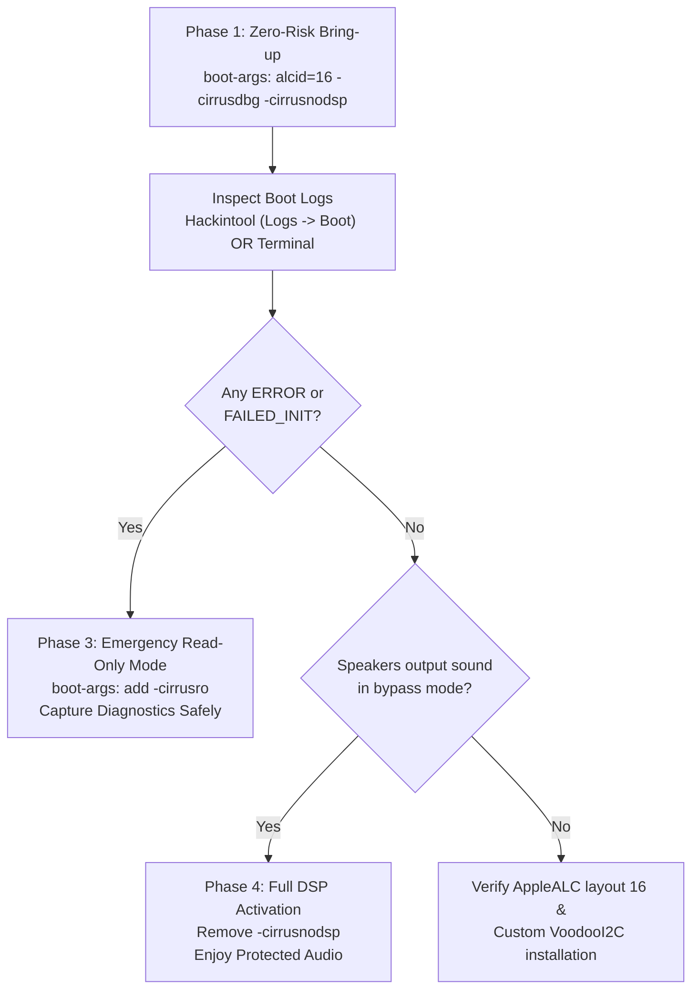

# Safe Bring-up and Diagnostics Protocol

Smart digital amplifiers like the Cirrus Logic CS35L41 feature integrated boost converters that step internal voltages up to 11V–17V. Driving mismatched firmware profiles or invalid register sequences can cause thermal runaway or permanently damage speaker voice coils.

To ensure absolute hardware safety, CirrusAudioFixup is designed around a **4-phase progressive bring-up protocol**.

---

## 4-Phase Progressive Bring-up Protocol



---

### Phase 1: Zero-risk bring-up (DAC bypass mode)

Never boot with full DSP firmware on an untested configuration. Always start with direct DAC bypass mode:

Add to your OpenCore `boot-args`:
```text
alcid=16 -cirrusdbg -cirrusnodsp
```

- `alcid=16`: Routes the digital audio stream from the Realtek ALC287 codec to the CS35L41 I2S lines.
- `-cirrusdbg`: Enables verbose driver lifecycle logging to the system log.
- `-cirrusnodsp`: Bypasses WMFW bytecode upload and Halo DSP activation. The amplifiers operate in direct DAC bypass mode at safe line voltages. If anything is wrong with bus addressing or firmware parsing, **your amplifier hardware is protected from harm**.

---

### Phase 2: Inspecting boot logs

After booting into macOS, verify whether the driver initialized the hardware cleanly before playing audio.

#### Method A: Using Hackintool (GUI)
1. Open **Hackintool**.
2. Navigate to the **Logs** tab.
3. Click the **System Log** sub-tab.
4. Click the **Boot** icon at the bottom of the window to load logs from the current boot.
5. In the search filter box, type: `CirrusAudioFixup`.
6. Review the output for initialization stages.

#### Method B: Using Terminal (CLI)
Run:
```bash
log show --last boot --style syslog --predicate 'eventMessage CONTAINS "CirrusAudioFixup"'
```

#### Method C: Checking IORegistry verdict
Run:
```bash
ioreg -lw0 -p IODeviceTree -n CLSA0100 | grep -E 'Cirrus_(Driver|Diag|Playback|Detected)'
```

Expected healthy output in bypass mode:
```text
"Cirrus_Driver_Verdict" = "READY_BYPASS_EXPLICIT"
"Cirrus_Detected_Amplifiers" = 2
"Cirrus_Diag_FirstFailure_left" = "NONE"
"Cirrus_Diag_FirstFailure_right" = "NONE"
```

---

### Phase 3: Emergency fallback on failure (Read-only mode)

If the log displays any `ERROR`, `FAILED_INIT`, or bus transfer timeouts:

> [!CAUTION]
> Do not attempt playback if initialization failed. Switch to read-only mode immediately.

Add `-cirrusro` to your OpenCore `boot-args`:
```text
alcid=16 -cirrusdbg -cirrusnodsp -cirrusro
```

- In Read-Only mode (`-cirrusro`), CirrusAudioFixup attaches to the device tree and monitors system audio streams, but **performs zero write operations to any I2C registers**.
- This guarantees absolute safety while you run [Tools/collect_macos.sh](file:///Users/hoaug/Documents/CirrusAudioFixup/Tools/collect_macos.sh) or inspect kernel diagnostics to diagnose the failure.

---

### Phase 4: Full DSP activation

Once:
1. Boot logs show `READY_BYPASS_EXPLICIT` with zero errors.
2. You have tested speaker playback and confirmed clean audio output in DAC bypass mode.

You can now safely activate the Halo DSP acoustic protection engine:

1. Open your `config.plist`.
2. Remove `-cirrusnodsp` from `boot-args`.
3. Keep or remove `-cirrusdbg` as desired.
4. Reboot your system.

Upon reboot, run:
```bash
ioreg -lw0 -p IODeviceTree -n CLSA0100 | grep Cirrus_Driver_Verdict
```

You should see:
```text
"Cirrus_Driver_Verdict" = "READY_DSP"
```

The Halo DSP core is now running Cirrus Sound Protection Lite (CSPL) firmware with per-speaker acoustic equalization and dynamic excursion limiting.
